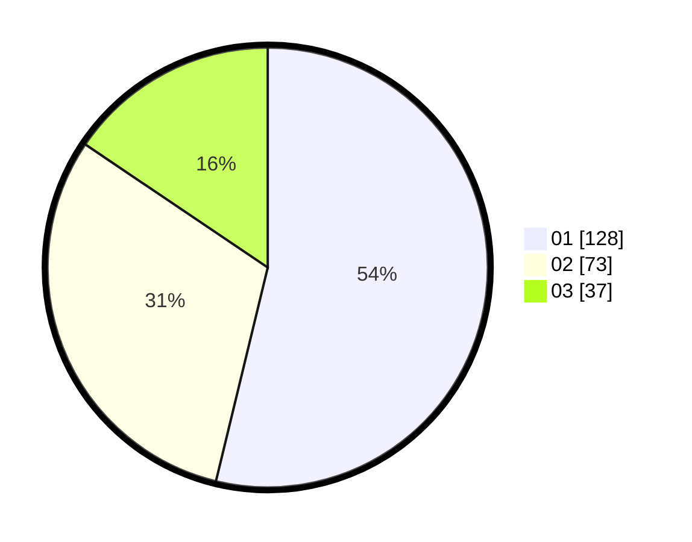

# Hasil

Hasil perolehan suara paslon dapat dilihat pada file paslon-01.txt, paslon-02.txt, dan paslon-03.txt.

Jika tidak ada, artinya data tersebut belum ada pada SIREKAP.

## Perolehan Suara

 * Paslon 01: **128**.
 * Paslon 02: **73**.
 * Paslon 03: **37**.

## Foto C Plano

https://sirekap-obj-formc.kpu.go.id/d792/pemilu/ppwp/31/75/02/10/02/3175021002054-20240215-212406--dbd4588c-0aeb-48d3-8c09-c61b350c680e.jpg

https://sirekap-obj-formc.kpu.go.id/d792/pemilu/ppwp/31/75/02/10/02/3175021002054-20240215-212407--93888d2e-2e73-4082-963c-5827aaf03b9b.jpg

https://sirekap-obj-formc.kpu.go.id/d792/pemilu/ppwp/31/75/02/10/02/3175021002054-20240215-212406--13fbdce0-ba0e-4d67-b25d-e6373e454312.jpg

## DATA PEMILIH TETAP

Jumlah pemilih dalam DPT: **289**.
 * L: **140**.
 * P: **149**.

## DATA PENGGUNA HAK PILIH

Jumlah pengguna hak pilih dalam DPT: **226**.
 * L: **100**.
 * P: **126**.

Jumlah pengguna hak pilih dalam DPTb: **13**.
 * L: **8**.
 * P: **5**.

Jumlah pengguna hak pilih dalam DPK: **1**.
 * L: **1**.
 * P: **0**.

Jumlah pengguna hak pilih: **240**.
 * L: **109**.
 * P: **131**.

## JUMLAH SUARA SAH DAN TIDAK SAH

JUMLAH SELURUH SUARA SAH: **238**.

JUMLAH SUARA TIDAK SAH: **2**.

JUMLAH SELURUH SUARA SAH DAN SUARA TIDAK SAH: **240**.
