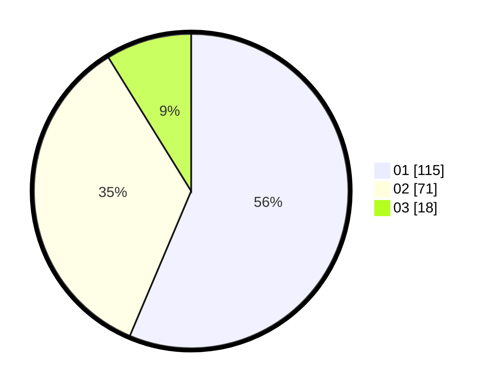

# Hasil

Hasil perolehan suara paslon dapat dilihat pada file paslon-01.txt, paslon-02.txt, dan paslon-03.txt.

Jika tidak ada, artinya data tersebut belum ada pada SIREKAP.

## Perolehan Suara

 * Paslon 01: **115**.
 * Paslon 02: **71**.
 * Paslon 03: **18**.

## Foto C Plano

https://sirekap-obj-formc.kpu.go.id/e6fb/pemilu/ppwp/31/75/02/10/02/3175021002056-20240214-212514--38fd76ef-4d41-4f50-8b71-9b5655b909b0.jpg

https://sirekap-obj-formc.kpu.go.id/e6fb/pemilu/ppwp/31/75/02/10/02/3175021002056-20240214-184608--286b1728-3c1a-4c61-be0f-cdddae1e363c.jpg

https://sirekap-obj-formc.kpu.go.id/e6fb/pemilu/ppwp/31/75/02/10/02/3175021002056-20240214-185042--02c707b2-2079-4ad2-a064-133edf295041.jpg
