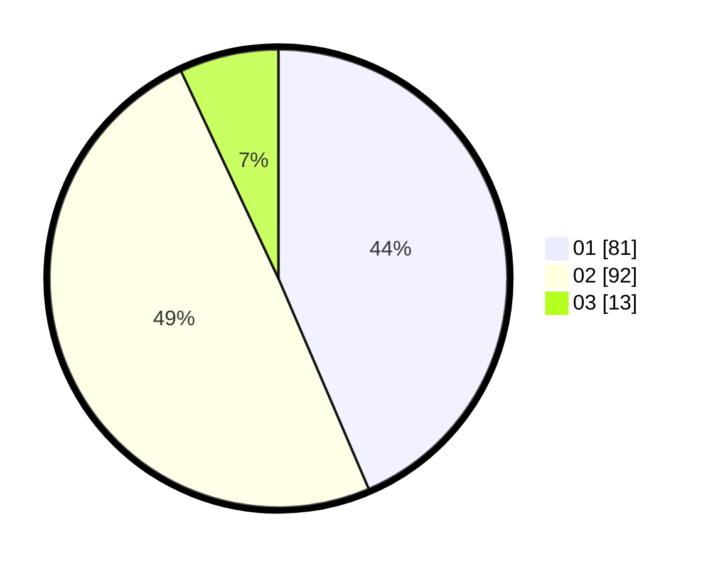

# Hasil

Hasil perolehan suara paslon dapat dilihat pada file paslon-01.txt, paslon-02.txt, dan paslon-03.txt.

Jika tidak ada, artinya data tersebut belum ada pada SIREKAP.

## Perolehan Suara

 * Paslon 01: **81**.
 * Paslon 02: **92**.
 * Paslon 03: **13**.

## Foto C Plano

https://sirekap-obj-formc.kpu.go.id/4f11/pemilu/ppwp/31/75/02/10/02/3175021002062-20240214-204104--4bf1fb17-4a1b-40ff-8385-1407385f92fa.jpg

https://sirekap-obj-formc.kpu.go.id/4f11/pemilu/ppwp/31/75/02/10/02/3175021002062-20240214-204252--315f3052-1e61-4cb9-aa60-fd7f6634a166.jpg

https://sirekap-obj-formc.kpu.go.id/4f11/pemilu/ppwp/31/75/02/10/02/3175021002062-20240214-204430--2acb7020-feb8-442a-a789-24e617afbb3e.jpg
