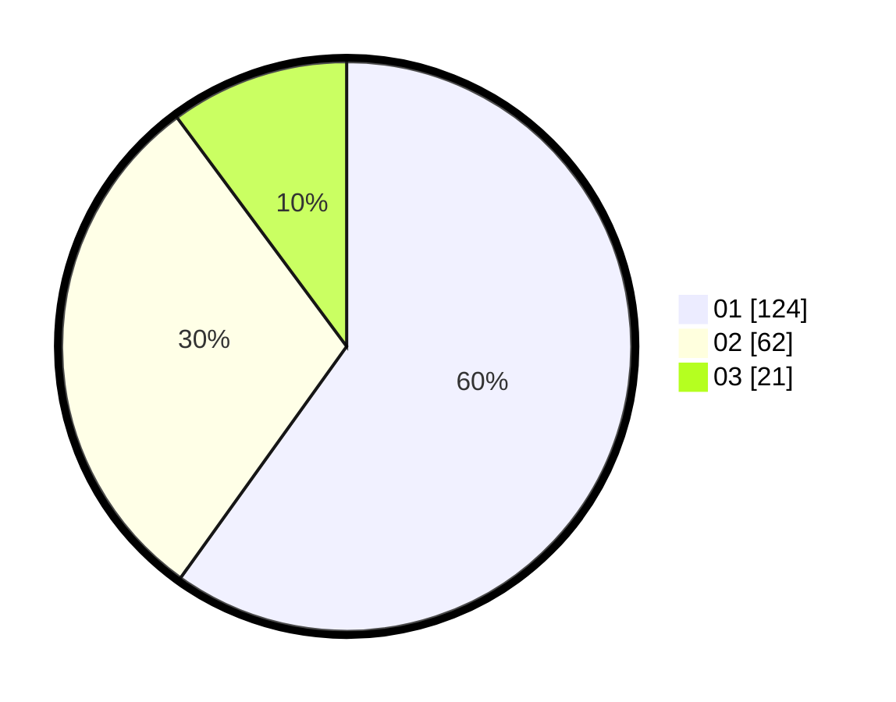

# Hasil

Hasil perolehan suara paslon dapat dilihat pada file paslon-01.txt, paslon-02.txt, dan paslon-03.txt.

Jika tidak ada, artinya data tersebut belum ada pada SIREKAP.

## Perolehan Suara

 * Paslon 01: **124**.
 * Paslon 02: **62**.
 * Paslon 03: **21**.

## Foto C Plano

https://sirekap-obj-formc.kpu.go.id/4ac4/pemilu/ppwp/31/75/02/10/02/3175021002063-20240216-002925--dcea8eb5-0280-468e-9e21-ebd4a758551a.jpg

https://sirekap-obj-formc.kpu.go.id/4ac4/pemilu/ppwp/31/75/02/10/02/3175021002063-20240216-002928--d74be928-b284-4635-96ed-5a9f402d4f87.jpg

https://sirekap-obj-formc.kpu.go.id/4ac4/pemilu/ppwp/31/75/02/10/02/3175021002063-20240216-002927--4ae2d1c9-5673-40d1-85f7-670ba766d2bb.jpg

## DATA PEMILIH TETAP

Jumlah pemilih dalam DPT: **275**.
 * L: **134**.
 * P: **141**.

## DATA PENGGUNA HAK PILIH

Jumlah pengguna hak pilih dalam DPT: **208**.
 * L: **98**.
 * P: **110**.

Jumlah pengguna hak pilih dalam DPTb: **1**.
 * L: **1**.
 * P: **0**.

Jumlah pengguna hak pilih dalam DPK: **0**.
 * L: **0**.
 * P: **0**.

Jumlah pengguna hak pilih: **209**.
 * L: **99**.
 * P: **110**.

## JUMLAH SUARA SAH DAN TIDAK SAH

JUMLAH SELURUH SUARA SAH: **207**.

JUMLAH SUARA TIDAK SAH: **2**.

JUMLAH SELURUH SUARA SAH DAN SUARA TIDAK SAH: **209**.
