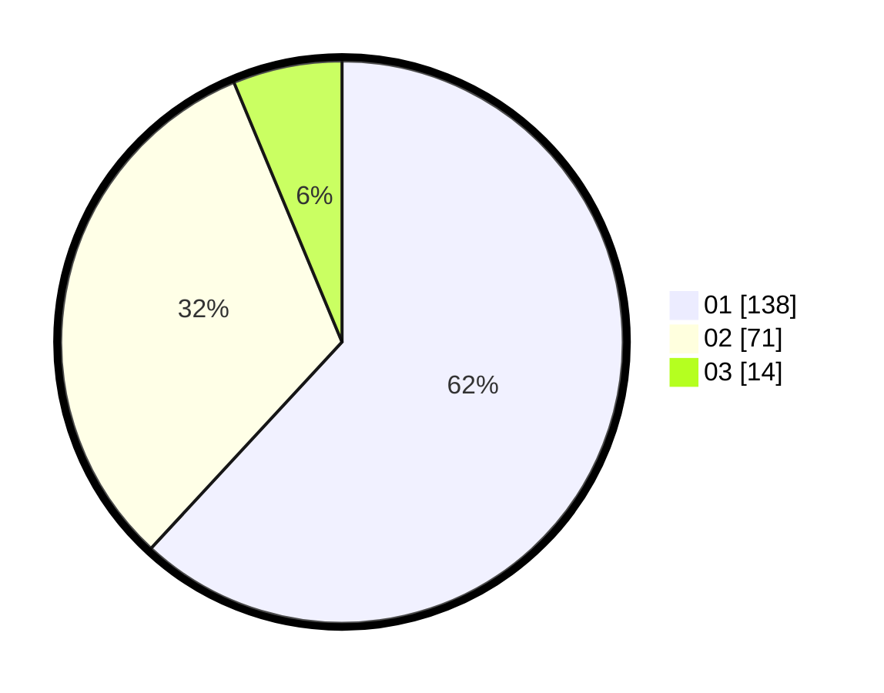

# Hasil

Hasil perolehan suara paslon dapat dilihat pada file paslon-01.txt, paslon-02.txt, dan paslon-03.txt.

Jika tidak ada, artinya data tersebut belum ada pada SIREKAP.

## Perolehan Suara

 * Paslon 01: **138**.
 * Paslon 02: **71**.
 * Paslon 03: **14**.

## Foto C Plano

https://sirekap-obj-formc.kpu.go.id/182f/pemilu/ppwp/31/75/02/10/02/3175021002064-20240216-082812--2c932a66-e1ae-41b2-a75b-2575a2f08615.jpg

https://sirekap-obj-formc.kpu.go.id/182f/pemilu/ppwp/31/75/02/10/02/3175021002064-20240214-210237--27f64add-c7cc-4aee-b9b5-a70b14b8ebc7.jpg

https://sirekap-obj-formc.kpu.go.id/182f/pemilu/ppwp/31/75/02/10/02/3175021002064-20240216-082813--876ca60b-b235-4c31-938f-9cb6bb109cc6.jpg

## DATA PEMILIH TETAP

Jumlah pemilih dalam DPT: **277**.
 * L: **138**.
 * P: **139**.

## DATA PENGGUNA HAK PILIH

Jumlah pengguna hak pilih dalam DPT: **223**.
 * L: **115**.
 * P: **108**.

Jumlah pengguna hak pilih dalam DPTb: **1**.
 * L: **1**.
 * P: **0**.

Jumlah pengguna hak pilih dalam DPK: **0**.
 * L: **0**.
 * P: **0**.

Jumlah pengguna hak pilih: **224**.
 * L: **116**.
 * P: **108**.

## JUMLAH SUARA SAH DAN TIDAK SAH

JUMLAH SELURUH SUARA SAH: **223**.

JUMLAH SUARA TIDAK SAH: **1**.

JUMLAH SELURUH SUARA SAH DAN SUARA TIDAK SAH: **224**.
