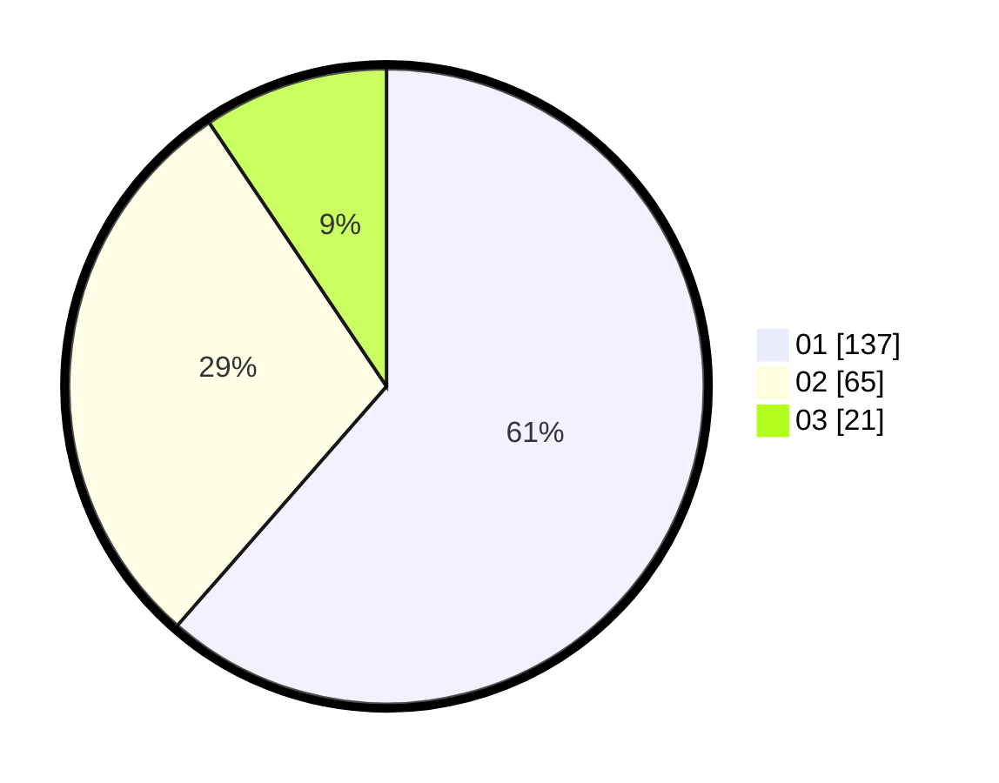

# Hasil

Hasil perolehan suara paslon dapat dilihat pada file paslon-01.txt, paslon-02.txt, dan paslon-03.txt.

Jika tidak ada, artinya data tersebut belum ada pada SIREKAP.

## Perolehan Suara

 * Paslon 01: **137**.
 * Paslon 02: **65**.
 * Paslon 03: **21**.

## Foto C Plano

https://sirekap-obj-formc.kpu.go.id/33d3/pemilu/ppwp/31/75/02/10/02/3175021002067-20240214-190731--114f841d-12bd-4d22-8903-af66337d713c.jpg

https://sirekap-obj-formc.kpu.go.id/33d3/pemilu/ppwp/31/75/02/10/02/3175021002067-20240214-190713--43d4e640-b686-4698-a5fe-7bd32d19e496.jpg

https://sirekap-obj-formc.kpu.go.id/33d3/pemilu/ppwp/31/75/02/10/02/3175021002067-20240214-190723--fc1d1cea-e97a-48a2-8abe-81ad20dba4f5.jpg

## DATA PEMILIH TETAP

Jumlah pemilih dalam DPT: **257**.
 * L: **128**.
 * P: **129**.

## DATA PENGGUNA HAK PILIH

Jumlah pengguna hak pilih dalam DPT: **207**.
 * L: **101**.
 * P: **106**.

Jumlah pengguna hak pilih dalam DPTb: **18**.
 * L: **13**.
 * P: **5**.

Jumlah pengguna hak pilih dalam DPK: **0**.
 * L: **0**.
 * P: **0**.

Jumlah pengguna hak pilih: **225**.
 * L: **114**.
 * P: **111**.

## JUMLAH SUARA SAH DAN TIDAK SAH

JUMLAH SELURUH SUARA SAH: **223**.

JUMLAH SUARA TIDAK SAH: **2**.

JUMLAH SELURUH SUARA SAH DAN SUARA TIDAK SAH: **225**.
