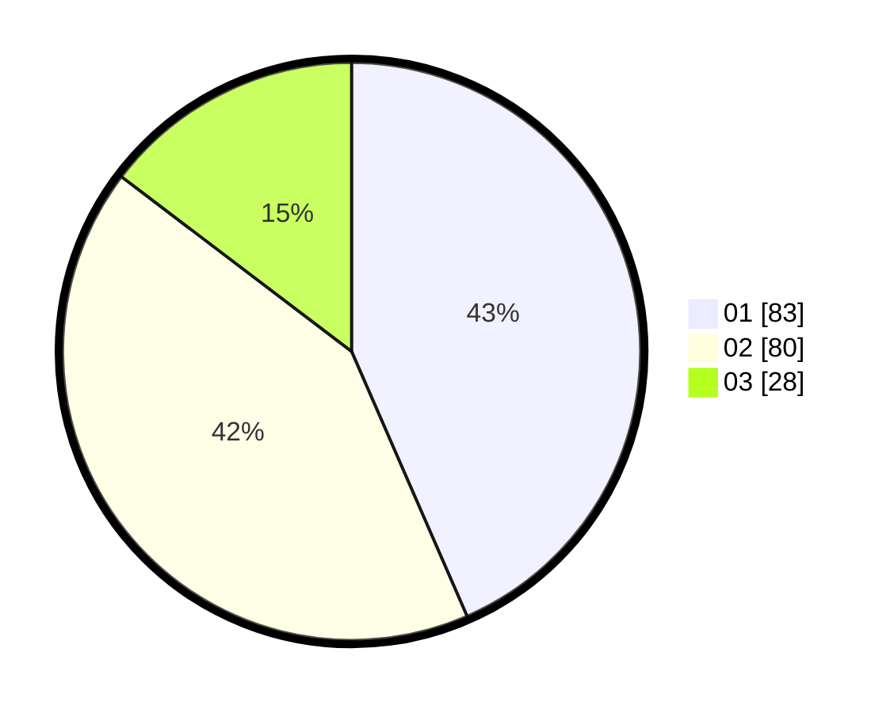

# Hasil

Hasil perolehan suara paslon dapat dilihat pada file paslon-01.txt, paslon-02.txt, dan paslon-03.txt.

Jika tidak ada, artinya data tersebut belum ada pada SIREKAP.

## Perolehan Suara

 * Paslon 01: **83**.
 * Paslon 02: **80**.
 * Paslon 03: **28**.

## Foto C Plano

https://sirekap-obj-formc.kpu.go.id/fb0d/pemilu/ppwp/31/75/02/10/02/3175021002073-20240214-201951--fac1bc6c-9cc6-4c1d-b70e-6a2acf5ec691.jpg

https://sirekap-obj-formc.kpu.go.id/fb0d/pemilu/ppwp/31/75/02/10/02/3175021002073-20240214-202127--8f86cfdc-2e74-4ebd-84ce-7fceb9422240.jpg

https://sirekap-obj-formc.kpu.go.id/fb0d/pemilu/ppwp/31/75/02/10/02/3175021002073-20240214-202257--aef840ac-4aad-413c-baea-375962aefdb4.jpg

## DATA PEMILIH TETAP

Jumlah pemilih dalam DPT: **195**.
 * L: **95**.
 * P: **100**.

## DATA PENGGUNA HAK PILIH

Jumlah pengguna hak pilih dalam DPT: **192**.
 * L: **94**.
 * P: **98**.

Jumlah pengguna hak pilih dalam DPTb: **2**.
 * L: **1**.
 * P: **1**.

Jumlah pengguna hak pilih dalam DPK: **1**.
 * L: **0**.
 * P: **1**.

Jumlah pengguna hak pilih: **195**.
 * L: **95**.
 * P: **100**.

## JUMLAH SUARA SAH DAN TIDAK SAH

JUMLAH SELURUH SUARA SAH: **191**.

JUMLAH SUARA TIDAK SAH: **4**.

JUMLAH SELURUH SUARA SAH DAN SUARA TIDAK SAH: **195**.
