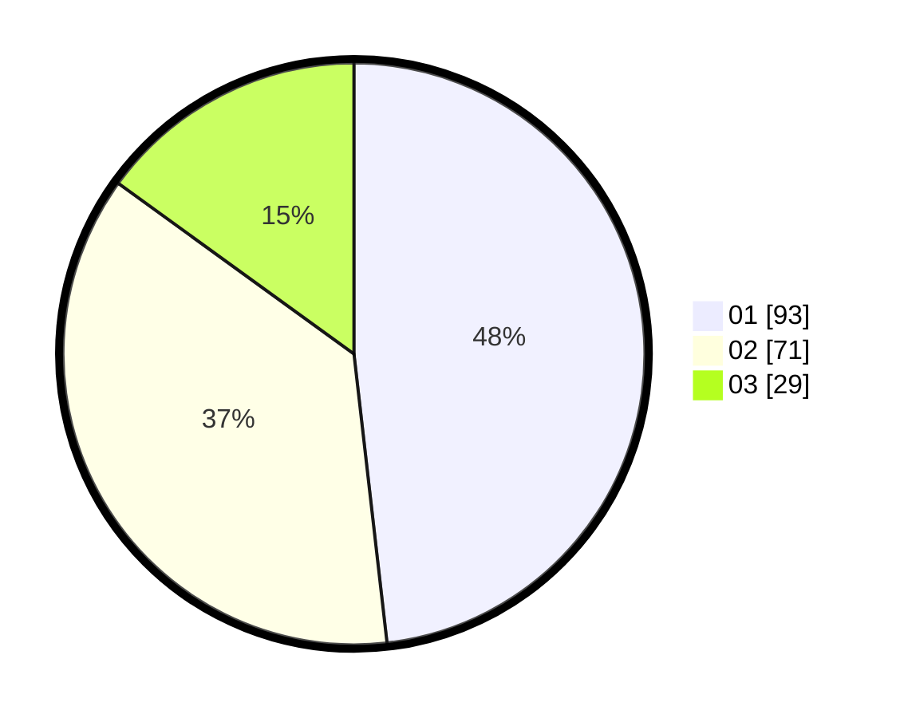

# Hasil

Hasil perolehan suara paslon dapat dilihat pada file paslon-01.txt, paslon-02.txt, dan paslon-03.txt.

Jika tidak ada, artinya data tersebut belum ada pada SIREKAP.

## Perolehan Suara

 * Paslon 01: **93**.
 * Paslon 02: **71**.
 * Paslon 03: **29**.

## Foto C Plano

https://sirekap-obj-formc.kpu.go.id/3332/pemilu/ppwp/31/75/02/10/02/3175021002075-20240215-172528--e8af8d5f-fd89-470c-be74-f9e09375e17c.jpg

https://sirekap-obj-formc.kpu.go.id/3332/pemilu/ppwp/31/75/02/10/02/3175021002075-20240215-172549--3e2a6209-6511-41ee-8701-2a0676b75a56.jpg

https://sirekap-obj-formc.kpu.go.id/3332/pemilu/ppwp/31/75/02/10/02/3175021002075-20240215-172538--1c002835-cc94-4e4d-a163-efde01234982.jpg

## DATA PEMILIH TETAP

Jumlah pemilih dalam DPT: **255**.
 * L: **125**.
 * P: **130**.

## DATA PENGGUNA HAK PILIH

Jumlah pengguna hak pilih dalam DPT: **193**.
 * L: **89**.
 * P: **104**.

Jumlah pengguna hak pilih dalam DPTb: **1**.
 * L: **1**.
 * P: **0**.

Jumlah pengguna hak pilih dalam DPK: **0**.
 * L: **0**.
 * P: **0**.

Jumlah pengguna hak pilih: **194**.
 * L: **90**.
 * P: **104**.

## JUMLAH SUARA SAH DAN TIDAK SAH

JUMLAH SELURUH SUARA SAH: **193**.

JUMLAH SUARA TIDAK SAH: **1**.

JUMLAH SELURUH SUARA SAH DAN SUARA TIDAK SAH: **194**.
