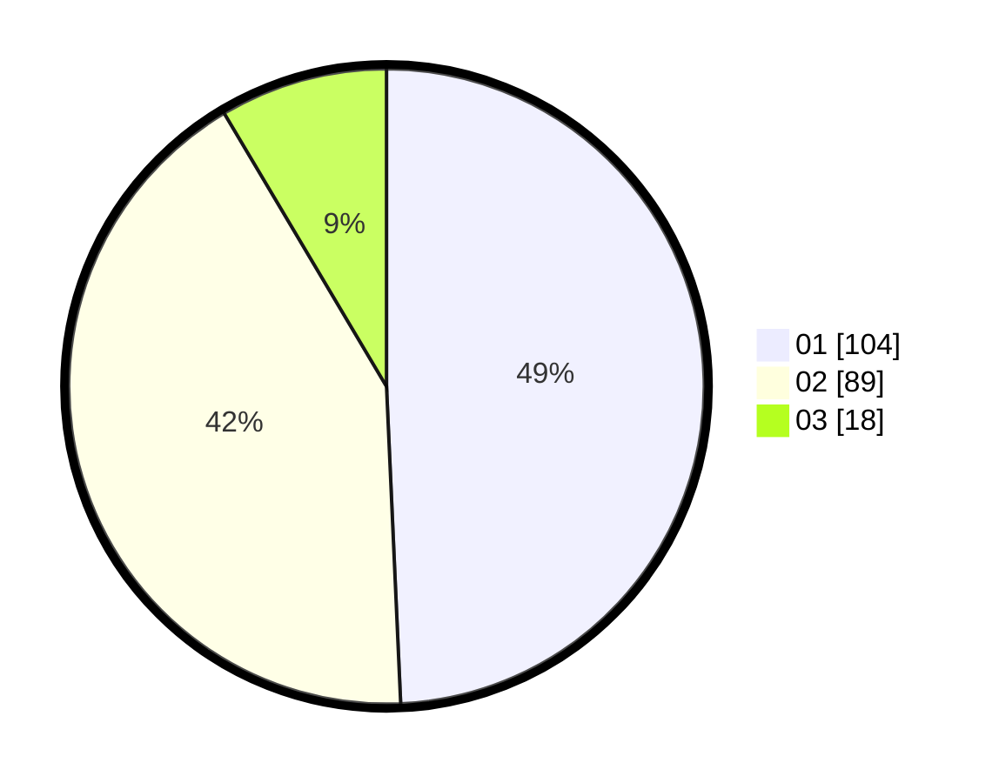

# Hasil

Hasil perolehan suara paslon dapat dilihat pada file paslon-01.txt, paslon-02.txt, dan paslon-03.txt.

Jika tidak ada, artinya data tersebut belum ada pada SIREKAP.

## Perolehan Suara

 * Paslon 01: **104**.
 * Paslon 02: **89**.
 * Paslon 03: **18**.

## Foto C Plano

https://sirekap-obj-formc.kpu.go.id/b1a5/pemilu/ppwp/31/75/02/10/02/3175021002079-20240216-001625--ac82b7b9-647a-4c1f-9467-ae79019ac1c5.jpg

https://sirekap-obj-formc.kpu.go.id/b1a5/pemilu/ppwp/31/75/02/10/02/3175021002079-20240216-001628--2f3dd08b-d632-4eed-8be7-505912894c3a.jpg

https://sirekap-obj-formc.kpu.go.id/b1a5/pemilu/ppwp/31/75/02/10/02/3175021002079-20240216-001627--d3b26773-4e45-41a8-8667-3e6a994e5800.jpg

## DATA PEMILIH TETAP

Jumlah pemilih dalam DPT: **271**.
 * L: **137**.
 * P: **134**.

## DATA PENGGUNA HAK PILIH

Jumlah pengguna hak pilih dalam DPT: **211**.
 * L: **111**.
 * P: **100**.

Jumlah pengguna hak pilih dalam DPTb: **0**.
 * L: **0**.
 * P: **0**.

Jumlah pengguna hak pilih dalam DPK: **1**.
 * L: **1**.
 * P: **0**.

Jumlah pengguna hak pilih: **212**.
 * L: **112**.
 * P: **100**.

## JUMLAH SUARA SAH DAN TIDAK SAH

JUMLAH SELURUH SUARA SAH: **211**.

JUMLAH SUARA TIDAK SAH: **1**.

JUMLAH SELURUH SUARA SAH DAN SUARA TIDAK SAH: **212**.
