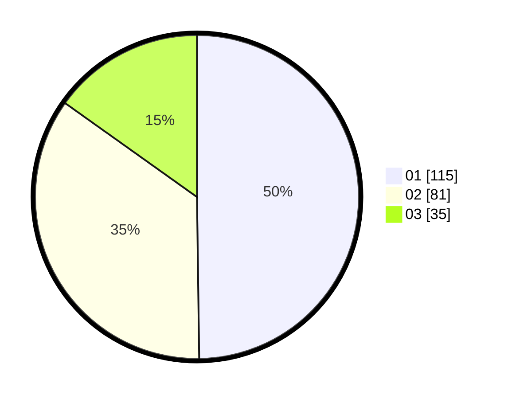

# Hasil

Hasil perolehan suara paslon dapat dilihat pada file paslon-01.txt, paslon-02.txt, dan paslon-03.txt.

Jika tidak ada, artinya data tersebut belum ada pada SIREKAP.

## Perolehan Suara

 * Paslon 01: **115**.
 * Paslon 02: **81**.
 * Paslon 03: **35**.

## Foto C Plano

https://sirekap-obj-formc.kpu.go.id/7846/pemilu/ppwp/31/75/02/10/02/3175021002080-20240214-155006--570fce81-cbc4-44ee-bf88-582f0fbd4559.jpg

https://sirekap-obj-formc.kpu.go.id/7846/pemilu/ppwp/31/75/02/10/02/3175021002080-20240214-155600--323f8435-95d9-451f-a29f-23cfb34d0b91.jpg

https://sirekap-obj-formc.kpu.go.id/7846/pemilu/ppwp/31/75/02/10/02/3175021002080-20240214-155658--603ec482-2751-4724-9c08-53188e1b88c4.jpg

## DATA PEMILIH TETAP

Jumlah pemilih dalam DPT: **274**.
 * L: **140**.
 * P: **134**.

## DATA PENGGUNA HAK PILIH

Jumlah pengguna hak pilih dalam DPT: **231**.
 * L: **116**.
 * P: **115**.

Jumlah pengguna hak pilih dalam DPTb: **2**.
 * L: **1**.
 * P: **1**.

Jumlah pengguna hak pilih dalam DPK: **0**.
 * L: **0**.
 * P: **0**.

Jumlah pengguna hak pilih: **233**.
 * L: **117**.
 * P: **116**.

## JUMLAH SUARA SAH DAN TIDAK SAH

JUMLAH SELURUH SUARA SAH: **231**.

JUMLAH SUARA TIDAK SAH: **2**.

JUMLAH SELURUH SUARA SAH DAN SUARA TIDAK SAH: **233**.
