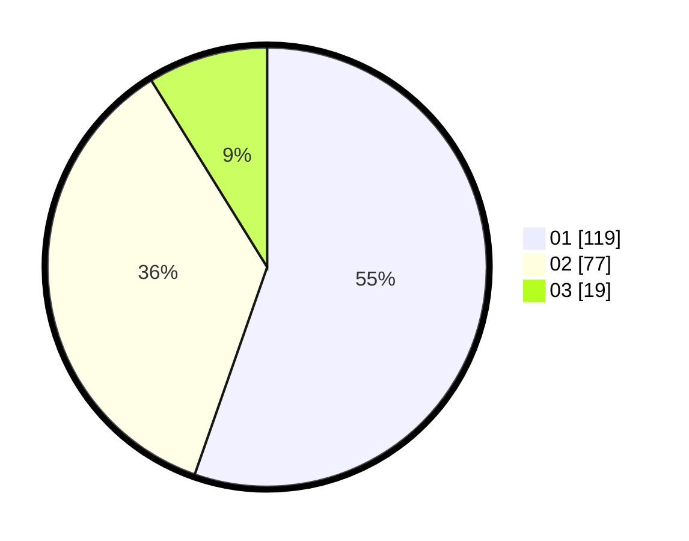

# Hasil

Hasil perolehan suara paslon dapat dilihat pada file paslon-01.txt, paslon-02.txt, dan paslon-03.txt.

Jika tidak ada, artinya data tersebut belum ada pada SIREKAP.

## Perolehan Suara

 * Paslon 01: **119**.
 * Paslon 02: **77**.
 * Paslon 03: **19**.

## Foto C Plano

https://sirekap-obj-formc.kpu.go.id/291d/pemilu/ppwp/31/75/02/10/02/3175021002082-20240215-014649--fc4aa7aa-b309-483d-b8de-70b11b1cc751.jpg

https://sirekap-obj-formc.kpu.go.id/291d/pemilu/ppwp/31/75/02/10/02/3175021002082-20240214-214625--ad17f835-91b5-46d9-86d5-6024e6b6556c.jpg

https://sirekap-obj-formc.kpu.go.id/291d/pemilu/ppwp/31/75/02/10/02/3175021002082-20240214-214716--b01f29ac-4e73-4537-8c8e-481122ae7857.jpg
