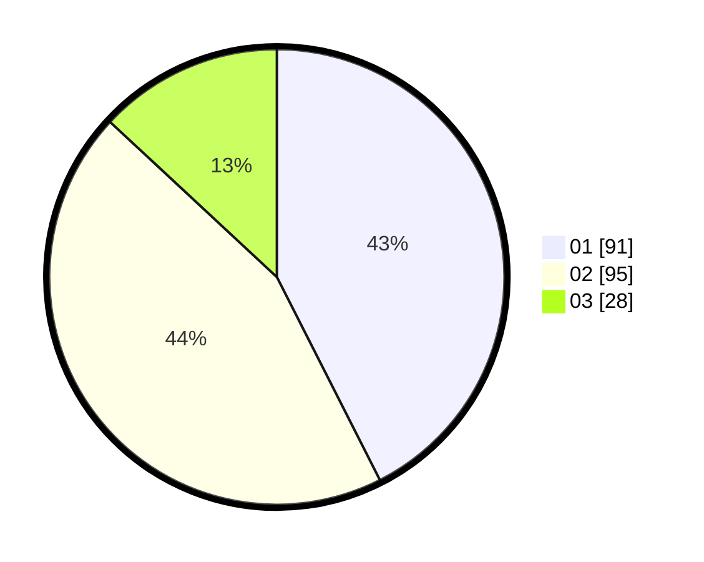

# Hasil

Hasil perolehan suara paslon dapat dilihat pada file paslon-01.txt, paslon-02.txt, dan paslon-03.txt.

Jika tidak ada, artinya data tersebut belum ada pada SIREKAP.

## Perolehan Suara

 * Paslon 01: **91**.
 * Paslon 02: **95**.
 * Paslon 03: **28**.

## Foto C Plano

https://sirekap-obj-formc.kpu.go.id/ae1d/pemilu/ppwp/31/75/02/10/02/3175021002083-20240215-031026--061acf01-5e68-4666-b205-1b5943a36a10.jpg

https://sirekap-obj-formc.kpu.go.id/ae1d/pemilu/ppwp/31/75/02/10/02/3175021002083-20240215-031144--9ddff591-e98f-4c35-82b7-a469e476305b.jpg

https://sirekap-obj-formc.kpu.go.id/ae1d/pemilu/ppwp/31/75/02/10/02/3175021002083-20240215-031313--10430217-1343-4101-9c55-f29910c9d624.jpg

## DATA PEMILIH TETAP

Jumlah pemilih dalam DPT: **273**.
 * L: **142**.
 * P: **131**.

## DATA PENGGUNA HAK PILIH

Jumlah pengguna hak pilih dalam DPT: **217**.
 * L: **107**.
 * P: **110**.

Jumlah pengguna hak pilih dalam DPTb: **0**.
 * L: **0**.
 * P: **0**.

Jumlah pengguna hak pilih dalam DPK: **1**.
 * L: **1**.
 * P: **0**.

Jumlah pengguna hak pilih: **218**.
 * L: **108**.
 * P: **110**.

## JUMLAH SUARA SAH DAN TIDAK SAH

JUMLAH SELURUH SUARA SAH: **214**.

JUMLAH SUARA TIDAK SAH: **4**.

JUMLAH SELURUH SUARA SAH DAN SUARA TIDAK SAH: **218**.
