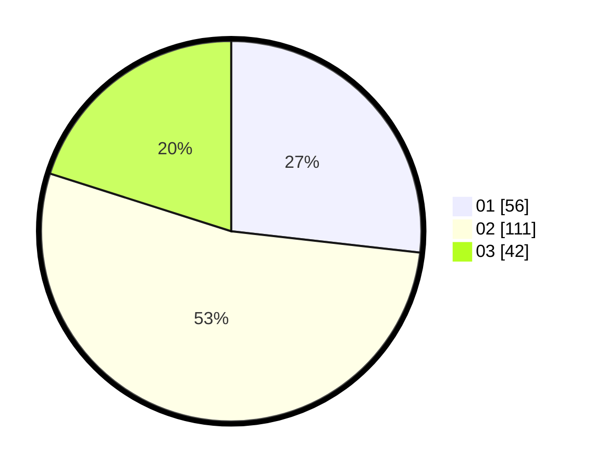

# Hasil

Hasil perolehan suara paslon dapat dilihat pada file paslon-01.txt, paslon-02.txt, dan paslon-03.txt.

Jika tidak ada, artinya data tersebut belum ada pada SIREKAP.

## Perolehan Suara

 * Paslon 01: **56**.
 * Paslon 02: **111**.
 * Paslon 03: **42**.

## Foto C Plano

https://sirekap-obj-formc.kpu.go.id/e3b7/pemilu/ppwp/31/75/02/10/02/3175021002087-20240214-184523--55867475-48ad-4ecc-9392-79ff8dbba0c6.jpg

https://sirekap-obj-formc.kpu.go.id/e3b7/pemilu/ppwp/31/75/02/10/02/3175021002087-20240214-184628--e47b90c3-0785-4af0-a07c-6916666da794.jpg

https://sirekap-obj-formc.kpu.go.id/e3b7/pemilu/ppwp/31/75/02/10/02/3175021002087-20240215-100346--7932d881-7e75-4683-955f-af3d927cbb17.jpg

## DATA PEMILIH TETAP

Jumlah pemilih dalam DPT: **266**.
 * L: **215**.
 * P: **151**.

## DATA PENGGUNA HAK PILIH

Jumlah pengguna hak pilih dalam DPT: **266**.
 * L: **115**.
 * P: **151**.

Jumlah pengguna hak pilih dalam DPTb: **2**.
 * L: **1**.
 * P: **1**.

Jumlah pengguna hak pilih dalam DPK: **0**.
 * L: **0**.
 * P: **0**.

Jumlah pengguna hak pilih: **268**.
 * L: **116**.
 * P: **152**.

## JUMLAH SUARA SAH DAN TIDAK SAH

JUMLAH SELURUH SUARA SAH: **209**.

JUMLAH SUARA TIDAK SAH: **2**.

JUMLAH SELURUH SUARA SAH DAN SUARA TIDAK SAH: **211**.
