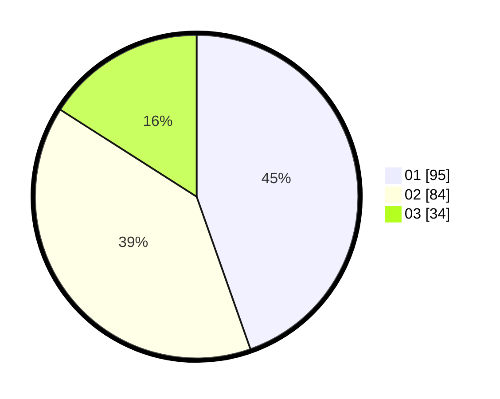

# Hasil

Hasil perolehan suara paslon dapat dilihat pada file paslon-01.txt, paslon-02.txt, dan paslon-03.txt.

Jika tidak ada, artinya data tersebut belum ada pada SIREKAP.

## Perolehan Suara

 * Paslon 01: **95**.
 * Paslon 02: **84**.
 * Paslon 03: **34**.

## Foto C Plano

https://sirekap-obj-formc.kpu.go.id/63e4/pemilu/ppwp/31/75/02/10/02/3175021002092-20240215-014740--a1ed0cb8-ea80-4b06-88f0-1f189d122cb9.jpg

https://sirekap-obj-formc.kpu.go.id/63e4/pemilu/ppwp/31/75/02/10/02/3175021002092-20240215-014851--b4720c60-ca92-4ca2-bd2a-a75118d8daeb.jpg

https://sirekap-obj-formc.kpu.go.id/63e4/pemilu/ppwp/31/75/02/10/02/3175021002092-20240215-045702--95ebf005-a7c4-41ef-9e3a-d8a077b91ace.jpg
