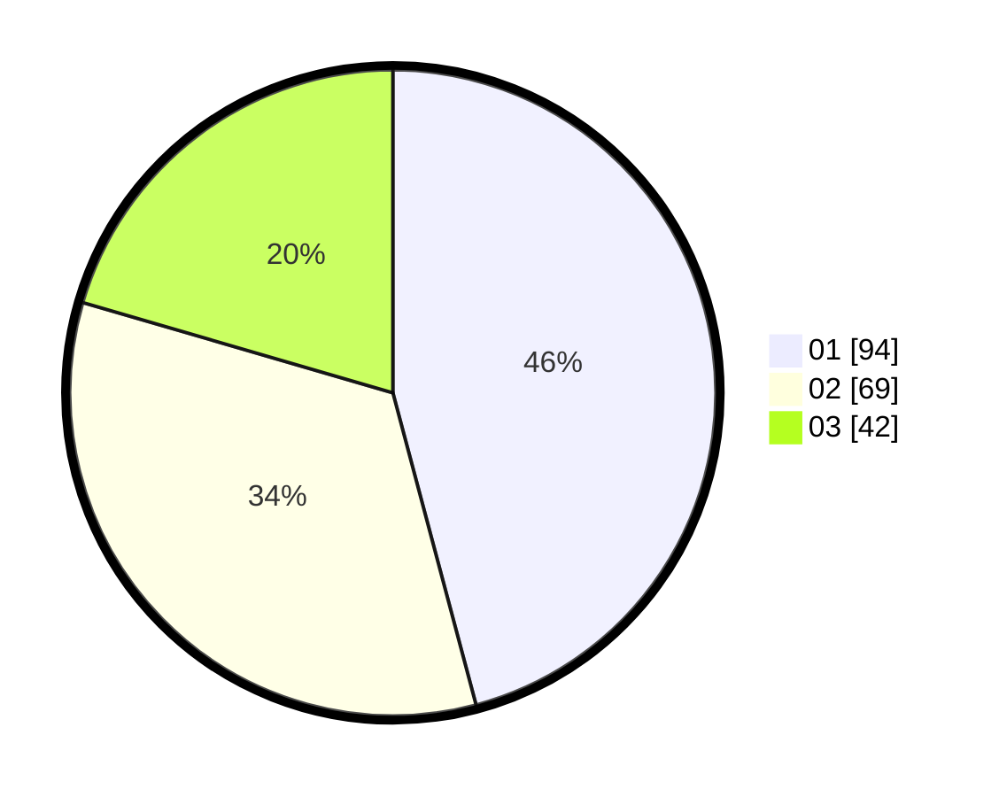

# Hasil

Hasil perolehan suara paslon dapat dilihat pada file paslon-01.txt, paslon-02.txt, dan paslon-03.txt.

Jika tidak ada, artinya data tersebut belum ada pada SIREKAP.

## Perolehan Suara

 * Paslon 01: **94**.
 * Paslon 02: **69**.
 * Paslon 03: **42**.

## Foto C Plano

https://sirekap-obj-formc.kpu.go.id/e50f/pemilu/ppwp/31/75/02/10/02/3175021002093-20240214-210655--1e97a13f-e187-47ea-af8a-c80e093a340f.jpg

https://sirekap-obj-formc.kpu.go.id/e50f/pemilu/ppwp/31/75/02/10/02/3175021002093-20240215-003258--898df6d3-45ae-4ef3-b16e-8aeec606512a.jpg

https://sirekap-obj-formc.kpu.go.id/e50f/pemilu/ppwp/31/75/02/10/02/3175021002093-20240214-210714--f5940c6b-8997-43d8-a072-6e6884e9d570.jpg

## DATA PEMILIH TETAP

Jumlah pemilih dalam DPT: **259**.
 * L: **121**.
 * P: **138**.

## DATA PENGGUNA HAK PILIH

Jumlah pengguna hak pilih dalam DPT: **259**.
 * L: **121**.
 * P: **138**.

Jumlah pengguna hak pilih dalam DPTb: **0**.
 * L: **0**.
 * P: **0**.

Jumlah pengguna hak pilih dalam DPK: **2**.
 * L: **1**.
 * P: **1**.

Jumlah pengguna hak pilih: **261**.
 * L: **122**.
 * P: **139**.

## JUMLAH SUARA SAH DAN TIDAK SAH

JUMLAH SELURUH SUARA SAH: **205**.

JUMLAH SUARA TIDAK SAH: **3**.

JUMLAH SELURUH SUARA SAH DAN SUARA TIDAK SAH: **208**.
