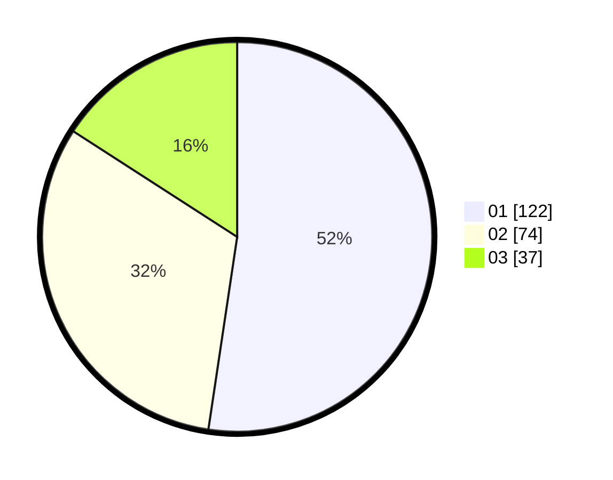

# Hasil

Hasil perolehan suara paslon dapat dilihat pada file paslon-01.txt, paslon-02.txt, dan paslon-03.txt.

Jika tidak ada, artinya data tersebut belum ada pada SIREKAP.

## Perolehan Suara

 * Paslon 01: **122**.
 * Paslon 02: **74**.
 * Paslon 03: **37**.

## Foto C Plano

https://sirekap-obj-formc.kpu.go.id/eda0/pemilu/ppwp/31/75/02/10/02/3175021002094-20240215-013923--24ac8195-3fc0-4d08-bde8-d4a6cb0cfd91.jpg

https://sirekap-obj-formc.kpu.go.id/eda0/pemilu/ppwp/31/75/02/10/02/3175021002094-20240214-214123--fa7eeed6-ea1a-4a04-9410-f2bea38c48fa.jpg

https://sirekap-obj-formc.kpu.go.id/eda0/pemilu/ppwp/31/75/02/10/02/3175021002094-20240214-215046--449fae4a-8b89-4e81-93e4-8c5d33dc4e3f.jpg

## DATA PEMILIH TETAP

Jumlah pemilih dalam DPT: **280**.
 * L: **130**.
 * P: **150**.

## DATA PENGGUNA HAK PILIH

Jumlah pengguna hak pilih dalam DPT: **233**.
 * L: **107**.
 * P: **126**.

Jumlah pengguna hak pilih dalam DPTb: **1**.
 * L: **1**.
 * P: **0**.

Jumlah pengguna hak pilih dalam DPK: **1**.
 * L: **0**.
 * P: **1**.

Jumlah pengguna hak pilih: **235**.
 * L: **108**.
 * P: **127**.

## JUMLAH SUARA SAH DAN TIDAK SAH

JUMLAH SELURUH SUARA SAH: **233**.

JUMLAH SUARA TIDAK SAH: **2**.

JUMLAH SELURUH SUARA SAH DAN SUARA TIDAK SAH: **235**.
