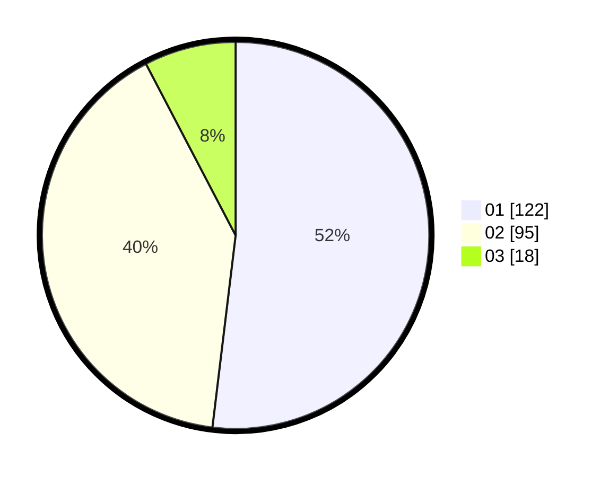

# Hasil

Hasil perolehan suara paslon dapat dilihat pada file paslon-01.txt, paslon-02.txt, dan paslon-03.txt.

Jika tidak ada, artinya data tersebut belum ada pada SIREKAP.

## Perolehan Suara

 * Paslon 01: **122**.
 * Paslon 02: **95**.
 * Paslon 03: **18**.

## Foto C Plano

https://sirekap-obj-formc.kpu.go.id/4753/pemilu/ppwp/31/75/02/10/02/3175021002096-20240214-190806--21826888-fea4-4707-8bcb-259a4e8dcc15.jpg

https://sirekap-obj-formc.kpu.go.id/4753/pemilu/ppwp/31/75/02/10/02/3175021002096-20240214-221229--9f78196b-af58-43d3-a710-7722b460c295.jpg

https://sirekap-obj-formc.kpu.go.id/4753/pemilu/ppwp/31/75/02/10/02/3175021002096-20240214-222222--23e1b6dd-7fd0-4fb7-91e2-cd1fb82f3097.jpg
