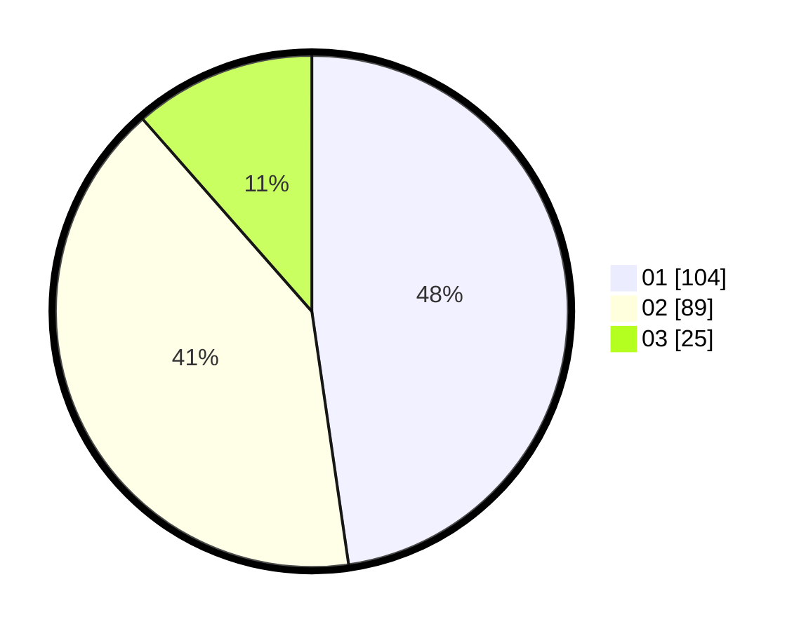

# Hasil

Hasil perolehan suara paslon dapat dilihat pada file paslon-01.txt, paslon-02.txt, dan paslon-03.txt.

Jika tidak ada, artinya data tersebut belum ada pada SIREKAP.

## Perolehan Suara

 * Paslon 01: **104**.
 * Paslon 02: **89**.
 * Paslon 03: **25**.

## Foto C Plano

https://sirekap-obj-formc.kpu.go.id/8787/pemilu/ppwp/31/75/02/10/02/3175021002099-20240216-142617--95e0944d-4464-4573-92bd-f3ed2e38463c.jpg

https://sirekap-obj-formc.kpu.go.id/8787/pemilu/ppwp/31/75/02/10/02/3175021002099-20240216-142618--195a0578-c7d1-4de4-848e-38a69ab56f6c.jpg

https://sirekap-obj-formc.kpu.go.id/8787/pemilu/ppwp/31/75/02/10/02/3175021002099-20240216-142618--cd96c70e-6861-4fb2-9da5-e51de38c2ab4.jpg

## DATA PEMILIH TETAP

Jumlah pemilih dalam DPT: **286**.
 * L: **140**.
 * P: **146**.

## DATA PENGGUNA HAK PILIH

Jumlah pengguna hak pilih dalam DPT: **217**.
 * L: **102**.
 * P: **115**.

Jumlah pengguna hak pilih dalam DPTb: **1**.
 * L: **0**.
 * P: **1**.

Jumlah pengguna hak pilih dalam DPK: **0**.
 * L: **0**.
 * P: **0**.

Jumlah pengguna hak pilih: **218**.
 * L: **102**.
 * P: **116**.

## JUMLAH SUARA SAH DAN TIDAK SAH

JUMLAH SELURUH SUARA SAH: **218**.

JUMLAH SUARA TIDAK SAH: **0**.

JUMLAH SELURUH SUARA SAH DAN SUARA TIDAK SAH: **218**.
