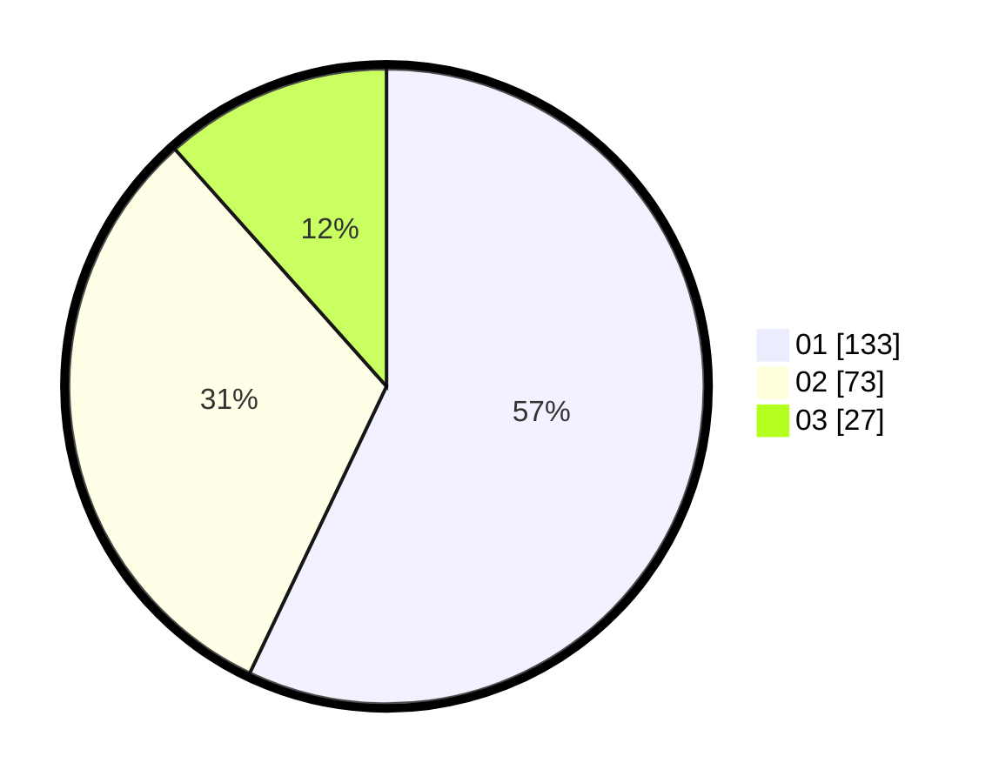

# Hasil

Hasil perolehan suara paslon dapat dilihat pada file paslon-01.txt, paslon-02.txt, dan paslon-03.txt.

Jika tidak ada, artinya data tersebut belum ada pada SIREKAP.

## Perolehan Suara

 * Paslon 01: **133**.
 * Paslon 02: **73**.
 * Paslon 03: **27**.

## Foto C Plano

https://sirekap-obj-formc.kpu.go.id/2975/pemilu/ppwp/31/75/02/10/02/3175021002103-20240215-230918--35c9864c-0a42-4083-a5da-d2fc6142e113.jpg

https://sirekap-obj-formc.kpu.go.id/2975/pemilu/ppwp/31/75/02/10/02/3175021002103-20240215-230919--4b11f849-968b-4468-b372-39c6e287046b.jpg

https://sirekap-obj-formc.kpu.go.id/2975/pemilu/ppwp/31/75/02/10/02/3175021002103-20240215-230919--37cd51b3-c2bb-4adb-ac19-34e518005cf8.jpg

## DATA PEMILIH TETAP

Jumlah pemilih dalam DPT: **265**.
 * L: **131**.
 * P: **134**.

## DATA PENGGUNA HAK PILIH

Jumlah pengguna hak pilih dalam DPT: **233**.
 * L: **114**.
 * P: **119**.

Jumlah pengguna hak pilih dalam DPTb: **3**.
 * L: **1**.
 * P: **2**.

Jumlah pengguna hak pilih dalam DPK: **0**.
 * L: **0**.
 * P: **0**.

Jumlah pengguna hak pilih: **236**.
 * L: **115**.
 * P: **121**.

## JUMLAH SUARA SAH DAN TIDAK SAH

JUMLAH SELURUH SUARA SAH: **233**.

JUMLAH SUARA TIDAK SAH: **3**.

JUMLAH SELURUH SUARA SAH DAN SUARA TIDAK SAH: **236**.
