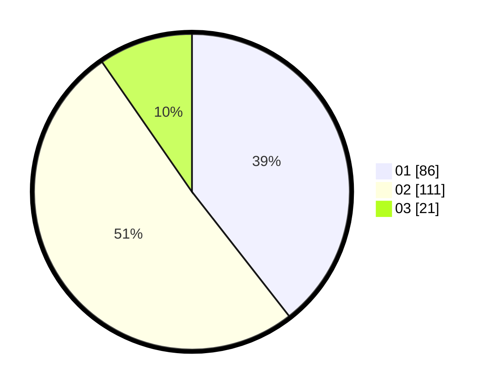

# Hasil

Hasil perolehan suara paslon dapat dilihat pada file paslon-01.txt, paslon-02.txt, dan paslon-03.txt.

Jika tidak ada, artinya data tersebut belum ada pada SIREKAP.

## Perolehan Suara

 * Paslon 01: **86**.
 * Paslon 02: **111**.
 * Paslon 03: **21**.

## Foto C Plano

https://sirekap-obj-formc.kpu.go.id/d11e/pemilu/ppwp/31/75/02/10/02/3175021002106-20240214-220951--86dec370-8c15-4866-9d0c-7477e6ef5949.jpg

https://sirekap-obj-formc.kpu.go.id/d11e/pemilu/ppwp/31/75/02/10/02/3175021002106-20240215-005808--89561cff-02b1-4075-ae94-99a33f5e159d.jpg

https://sirekap-obj-formc.kpu.go.id/d11e/pemilu/ppwp/31/75/02/10/02/3175021002106-20240214-221750--ed448218-2aa7-43ef-b9fd-d434860ccd3d.jpg

## DATA PEMILIH TETAP

Jumlah pemilih dalam DPT: **281**.
 * L: **139**.
 * P: **142**.

## DATA PENGGUNA HAK PILIH

Jumlah pengguna hak pilih dalam DPT: **225**.
 * L: **112**.
 * P: **113**.

Jumlah pengguna hak pilih dalam DPTb: **888**.
 * L: **0**.
 * P: **0**.

Jumlah pengguna hak pilih dalam DPK: **0**.
 * L: **0**.
 * P: **0**.

Jumlah pengguna hak pilih: **225**.
 * L: **112**.
 * P: **113**.

## JUMLAH SUARA SAH DAN TIDAK SAH

JUMLAH SELURUH SUARA SAH: **218**.

JUMLAH SUARA TIDAK SAH: **7**.

JUMLAH SELURUH SUARA SAH DAN SUARA TIDAK SAH: **225**.
