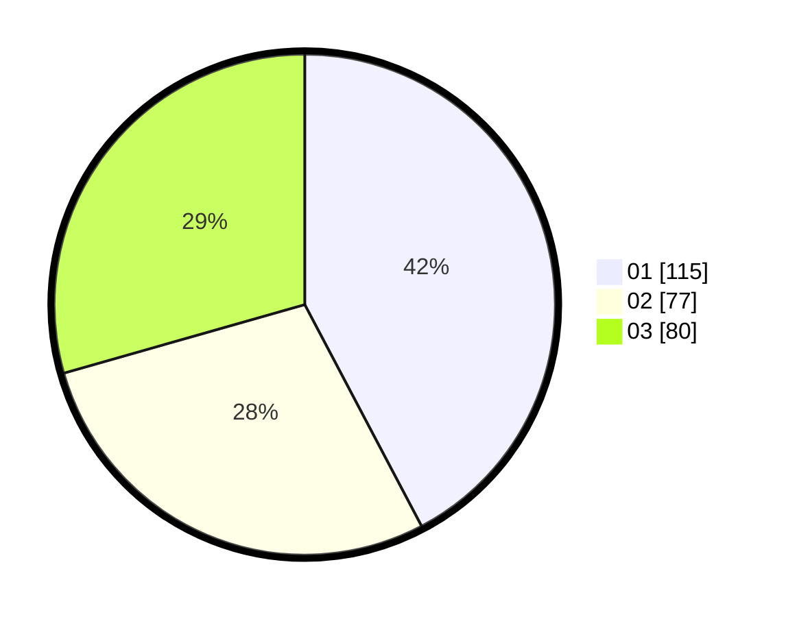

# Hasil

Hasil perolehan suara paslon dapat dilihat pada file paslon-01.txt, paslon-02.txt, dan paslon-03.txt.

Jika tidak ada, artinya data tersebut belum ada pada SIREKAP.

## Perolehan Suara

 * Paslon 01: **115**.
 * Paslon 02: **77**.
 * Paslon 03: **80**.

## Foto C Plano

https://sirekap-obj-formc.kpu.go.id/43ca/pemilu/ppwp/31/75/02/10/02/3175021002107-20240216-032050--f06a0bfa-c10c-42a8-b325-fa3f50c9d1f2.jpg

https://sirekap-obj-formc.kpu.go.id/43ca/pemilu/ppwp/31/75/02/10/02/3175021002107-20240216-032051--6a07ab58-88f7-4cf0-ae42-b71682f254de.jpg

https://sirekap-obj-formc.kpu.go.id/43ca/pemilu/ppwp/31/75/02/10/02/3175021002107-20240216-015248--083c1a83-2f7b-42ca-9208-a8b8ccb3fa30.jpg

## DATA PEMILIH TETAP

Jumlah pemilih dalam DPT: **279**.
 * L: **132**.
 * P: **147**.

## DATA PENGGUNA HAK PILIH

Jumlah pengguna hak pilih dalam DPT: **219**.
 * L: **102**.
 * P: **117**.

Jumlah pengguna hak pilih dalam DPTb: **2**.
 * L: **1**.
 * P: **1**.

Jumlah pengguna hak pilih dalam DPK: **4**.
 * L: **1**.
 * P: **3**.

Jumlah pengguna hak pilih: **225**.
 * L: **104**.
 * P: **121**.

## JUMLAH SUARA SAH DAN TIDAK SAH

JUMLAH SELURUH SUARA SAH: **222**.

JUMLAH SUARA TIDAK SAH: **3**.

JUMLAH SELURUH SUARA SAH DAN SUARA TIDAK SAH: **225**.
