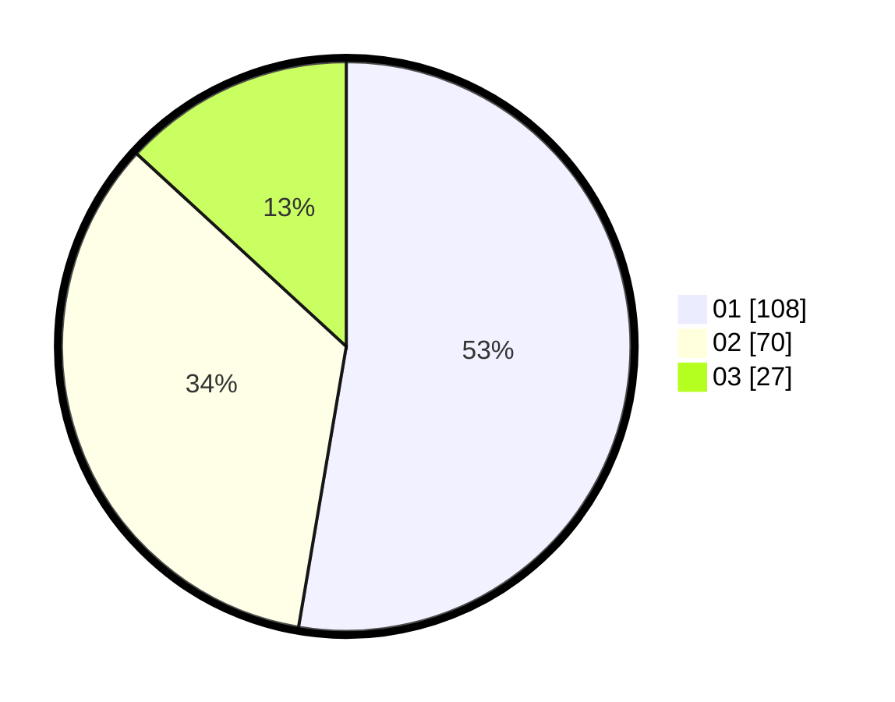

# Hasil

Hasil perolehan suara paslon dapat dilihat pada file paslon-01.txt, paslon-02.txt, dan paslon-03.txt.

Jika tidak ada, artinya data tersebut belum ada pada SIREKAP.

## Perolehan Suara

 * Paslon 01: **108**.
 * Paslon 02: **70**.
 * Paslon 03: **27**.

## Foto C Plano

https://sirekap-obj-formc.kpu.go.id/b5c2/pemilu/ppwp/31/75/02/10/02/3175021002112-20240214-234643--7f492d59-2595-4e15-bd62-6041a42a9b65.jpg

https://sirekap-obj-formc.kpu.go.id/b5c2/pemilu/ppwp/31/75/02/10/02/3175021002112-20240214-234820--2abe32fa-c7e3-4d8d-9780-f8bc75aea060.jpg

https://sirekap-obj-formc.kpu.go.id/b5c2/pemilu/ppwp/31/75/02/10/02/3175021002112-20240214-234959--325aad9f-a13c-4da7-b58a-3cfe549badaa.jpg
