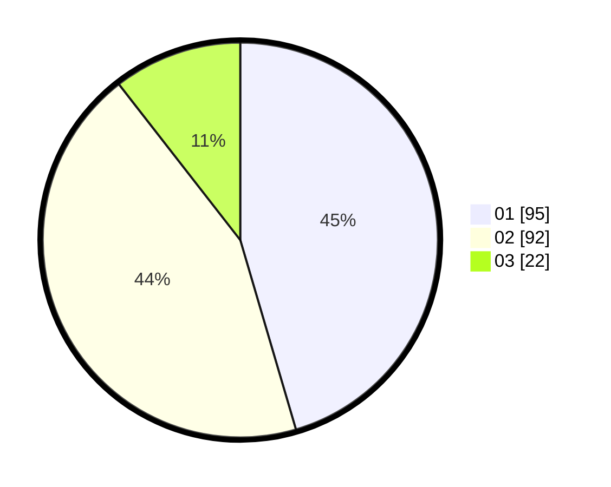

# Hasil

Hasil perolehan suara paslon dapat dilihat pada file paslon-01.txt, paslon-02.txt, dan paslon-03.txt.

Jika tidak ada, artinya data tersebut belum ada pada SIREKAP.

## Perolehan Suara

 * Paslon 01: **95**.
 * Paslon 02: **92**.
 * Paslon 03: **22**.

## Foto C Plano

https://sirekap-obj-formc.kpu.go.id/db59/pemilu/ppwp/31/75/02/10/02/3175021002118-20240214-204556--0a11a242-28aa-45d8-bb8c-f9325243d08e.jpg

https://sirekap-obj-formc.kpu.go.id/db59/pemilu/ppwp/31/75/02/10/02/3175021002118-20240214-204614--ac15e6e8-758d-4591-97b2-3f94be9b56dd.jpg

https://sirekap-obj-formc.kpu.go.id/db59/pemilu/ppwp/31/75/02/10/02/3175021002118-20240214-204627--a473f1b5-f515-4336-94ba-cf7bbd193983.jpg

## DATA PEMILIH TETAP

Jumlah pemilih dalam DPT: **264**.
 * L: **128**.
 * P: **136**.

## DATA PENGGUNA HAK PILIH

Jumlah pengguna hak pilih dalam DPT: **214**.
 * L: **100**.
 * P: **114**.

Jumlah pengguna hak pilih dalam DPTb: **0**.
 * L: **0**.
 * P: **0**.

Jumlah pengguna hak pilih dalam DPK: **0**.
 * L: **0**.
 * P: **0**.

Jumlah pengguna hak pilih: **214**.
 * L: **100**.
 * P: **114**.

## JUMLAH SUARA SAH DAN TIDAK SAH

JUMLAH SELURUH SUARA SAH: **209**.

JUMLAH SUARA TIDAK SAH: **5**.

JUMLAH SELURUH SUARA SAH DAN SUARA TIDAK SAH: **214**.
