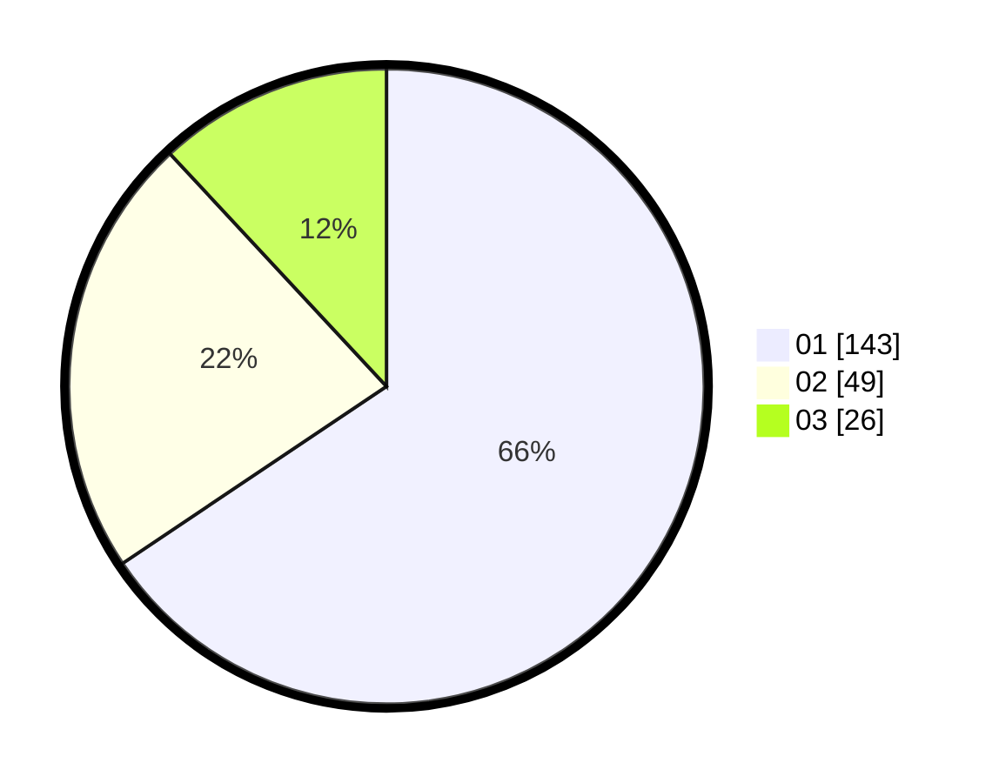

# Hasil

Hasil perolehan suara paslon dapat dilihat pada file paslon-01.txt, paslon-02.txt, dan paslon-03.txt.

Jika tidak ada, artinya data tersebut belum ada pada SIREKAP.

## Perolehan Suara

 * Paslon 01: **143**.
 * Paslon 02: **49**.
 * Paslon 03: **26**.

## Foto C Plano

https://sirekap-obj-formc.kpu.go.id/f454/pemilu/ppwp/31/75/02/10/02/3175021002122-20240215-031106--f9e74ab4-7bd9-49d0-b36b-d9221367d17b.jpg

https://sirekap-obj-formc.kpu.go.id/f454/pemilu/ppwp/31/75/02/10/02/3175021002122-20240215-031235--674dbf92-340a-4182-8fa5-fa0c93d5d852.jpg

https://sirekap-obj-formc.kpu.go.id/f454/pemilu/ppwp/31/75/02/10/02/3175021002122-20240217-230602--b36f03cf-8e4e-48b2-86d9-27ca7476837f.jpg

## DATA PEMILIH TETAP

Jumlah pemilih dalam DPT: **267**.
 * L: **129**.
 * P: **138**.

## DATA PENGGUNA HAK PILIH

Jumlah pengguna hak pilih dalam DPT: **221**.
 * L: **102**.
 * P: **119**.

Jumlah pengguna hak pilih dalam DPTb: **0**.
 * L: **0**.
 * P: **0**.

Jumlah pengguna hak pilih dalam DPK: **1**.
 * L: **0**.
 * P: **1**.

Jumlah pengguna hak pilih: **222**.
 * L: **102**.
 * P: **120**.

## JUMLAH SUARA SAH DAN TIDAK SAH

JUMLAH SELURUH SUARA SAH: **218**.

JUMLAH SUARA TIDAK SAH: **4**.

JUMLAH SELURUH SUARA SAH DAN SUARA TIDAK SAH: **222**.
