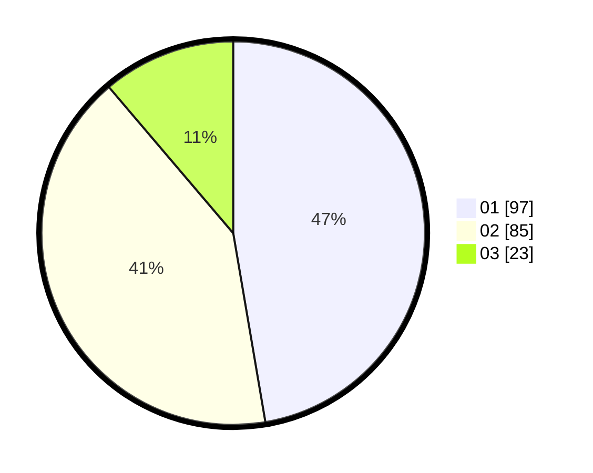

# Hasil

Hasil perolehan suara paslon dapat dilihat pada file paslon-01.txt, paslon-02.txt, dan paslon-03.txt.

Jika tidak ada, artinya data tersebut belum ada pada SIREKAP.

## Perolehan Suara

 * Paslon 01: **97**.
 * Paslon 02: **85**.
 * Paslon 03: **23**.

## Foto C Plano

https://sirekap-obj-formc.kpu.go.id/9991/pemilu/ppwp/31/75/02/10/02/3175021002126-20240216-111210--4a444e83-0823-4e43-be07-f3159ca19457.jpg

https://sirekap-obj-formc.kpu.go.id/9991/pemilu/ppwp/31/75/02/10/02/3175021002126-20240216-135754--58bdfaa2-09c9-4af2-b762-1d63f3e5270b.jpg

https://sirekap-obj-formc.kpu.go.id/9991/pemilu/ppwp/31/75/02/10/02/3175021002126-20240216-132320--b52e6484-9d2c-4df8-ada7-81250b323f19.jpg

## DATA PEMILIH TETAP

Jumlah pemilih dalam DPT: **259**.
 * L: **136**.
 * P: **123**.

## DATA PENGGUNA HAK PILIH

Jumlah pengguna hak pilih dalam DPT: **207**.
 * L: **105**.
 * P: **102**.

Jumlah pengguna hak pilih dalam DPTb: **0**.
 * L: **0**.
 * P: **0**.

Jumlah pengguna hak pilih dalam DPK: **2**.
 * L: **1**.
 * P: **1**.

Jumlah pengguna hak pilih: **209**.
 * L: **106**.
 * P: **103**.

## JUMLAH SUARA SAH DAN TIDAK SAH

JUMLAH SELURUH SUARA SAH: **206**.

JUMLAH SUARA TIDAK SAH: **3**.

JUMLAH SELURUH SUARA SAH DAN SUARA TIDAK SAH: **209**.
