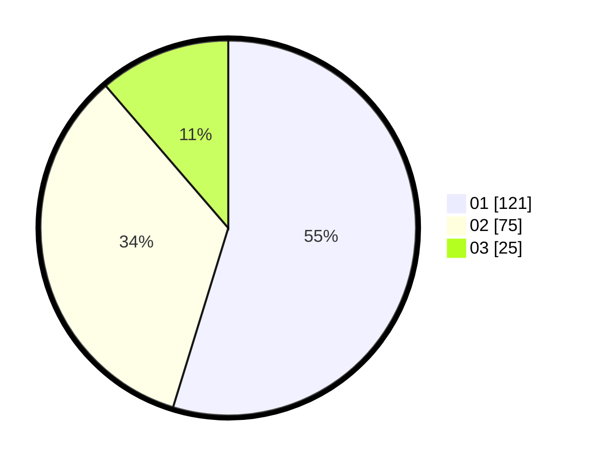

# Hasil

Hasil perolehan suara paslon dapat dilihat pada file paslon-01.txt, paslon-02.txt, dan paslon-03.txt.

Jika tidak ada, artinya data tersebut belum ada pada SIREKAP.

## Perolehan Suara

 * Paslon 01: **121**.
 * Paslon 02: **75**.
 * Paslon 03: **25**.

## Foto C Plano

https://sirekap-obj-formc.kpu.go.id/00ab/pemilu/ppwp/31/75/02/10/02/3175021002128-20240215-194102--1aceab5a-0996-4596-8e09-b96e81dd1f72.jpg

https://sirekap-obj-formc.kpu.go.id/00ab/pemilu/ppwp/31/75/02/10/02/3175021002128-20240215-023307--bfd2a48b-ab05-4249-91e7-b227509d2fd3.jpg

https://sirekap-obj-formc.kpu.go.id/00ab/pemilu/ppwp/31/75/02/10/02/3175021002128-20240215-023314--361f6986-367f-4d8c-b725-647c4e758673.jpg
