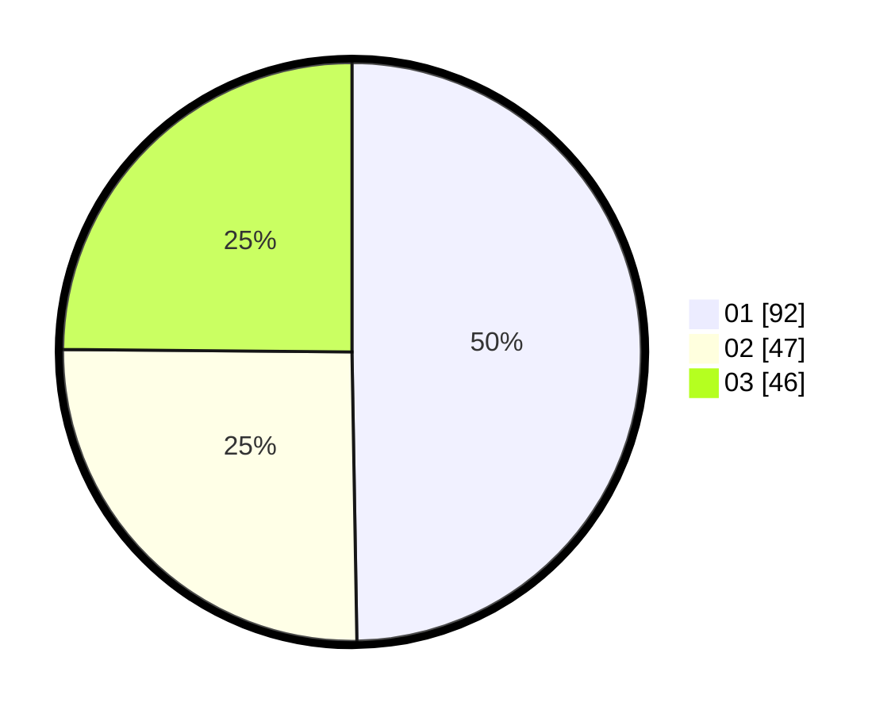

# Hasil

Hasil perolehan suara paslon dapat dilihat pada file paslon-01.txt, paslon-02.txt, dan paslon-03.txt.

Jika tidak ada, artinya data tersebut belum ada pada SIREKAP.

## Perolehan Suara

 * Paslon 01: **92**.
 * Paslon 02: **47**.
 * Paslon 03: **46**.

## Foto C Plano

https://sirekap-obj-formc.kpu.go.id/e110/pemilu/ppwp/31/75/02/10/02/3175021002132-20240214-235502--9b526dcf-6296-496d-ac6f-3c0c8bb6c912.jpg

https://sirekap-obj-formc.kpu.go.id/e110/pemilu/ppwp/31/75/02/10/02/3175021002132-20240214-235226--ee2bc66a-656c-4b13-b2c4-b7bbf20f6652.jpg

https://sirekap-obj-formc.kpu.go.id/e110/pemilu/ppwp/31/75/02/10/02/3175021002132-20240214-235302--83b0711e-62bc-4598-9603-3a14bec895b3.jpg

## DATA PEMILIH TETAP

Jumlah pemilih dalam DPT: **280**.
 * L: **142**.
 * P: **138**.

## DATA PENGGUNA HAK PILIH

Jumlah pengguna hak pilih dalam DPT: **226**.
 * L: **113**.
 * P: **113**.

Jumlah pengguna hak pilih dalam DPTb: **2**.
 * L: **1**.
 * P: **1**.

Jumlah pengguna hak pilih dalam DPK: **1**.
 * L: **0**.
 * P: **1**.

Jumlah pengguna hak pilih: **229**.
 * L: **114**.
 * P: **115**.

## JUMLAH SUARA SAH DAN TIDAK SAH

JUMLAH SELURUH SUARA SAH: **224**.

JUMLAH SUARA TIDAK SAH: **5**.

JUMLAH SELURUH SUARA SAH DAN SUARA TIDAK SAH: **229**.
