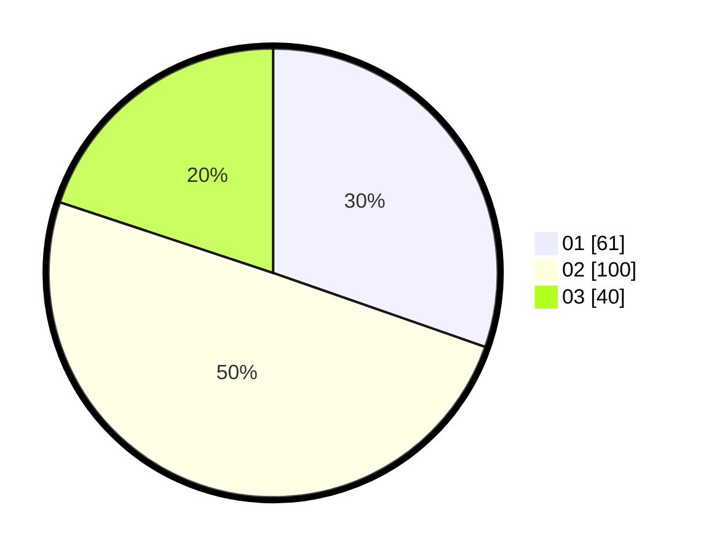

# Hasil

Hasil perolehan suara paslon dapat dilihat pada file paslon-01.txt, paslon-02.txt, dan paslon-03.txt.

Jika tidak ada, artinya data tersebut belum ada pada SIREKAP.

## Perolehan Suara

 * Paslon 01: **61**.
 * Paslon 02: **100**.
 * Paslon 03: **40**.

## Foto C Plano

https://sirekap-obj-formc.kpu.go.id/dd1f/pemilu/ppwp/31/75/02/10/02/3175021002138-20240216-024721--551bbbe4-7db2-4107-aaea-b1dbf9ef9d1f.jpg

https://sirekap-obj-formc.kpu.go.id/dd1f/pemilu/ppwp/31/75/02/10/02/3175021002138-20240216-024735--9b465c3a-a304-4415-a38e-926288310b30.jpg

https://sirekap-obj-formc.kpu.go.id/dd1f/pemilu/ppwp/31/75/02/10/02/3175021002138-20240216-024726--36c2bf8f-dcee-4403-9d30-6ec0d73d6e8f.jpg

## DATA PEMILIH TETAP

Jumlah pemilih dalam DPT: **277**.
 * L: **134**.
 * P: **143**.

## DATA PENGGUNA HAK PILIH

Jumlah pengguna hak pilih dalam DPT: **196**.
 * L: **91**.
 * P: **105**.

Jumlah pengguna hak pilih dalam DPTb: **5**.
 * L: **1**.
 * P: **4**.

Jumlah pengguna hak pilih dalam DPK: **2**.
 * L: **2**.
 * P: **0**.

Jumlah pengguna hak pilih: **203**.
 * L: **94**.
 * P: **109**.

## JUMLAH SUARA SAH DAN TIDAK SAH

JUMLAH SELURUH SUARA SAH: **201**.

JUMLAH SUARA TIDAK SAH: **2**.

JUMLAH SELURUH SUARA SAH DAN SUARA TIDAK SAH: **203**.
