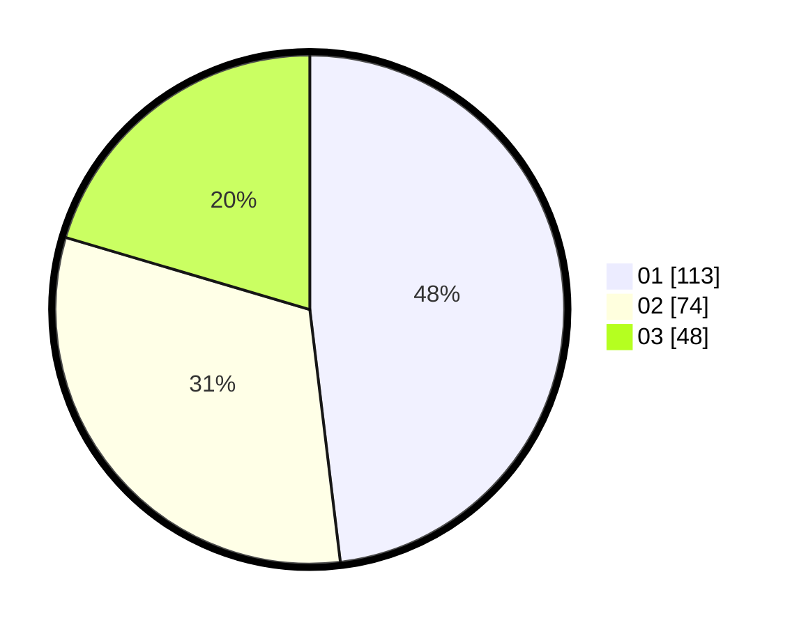

# Hasil

Hasil perolehan suara paslon dapat dilihat pada file paslon-01.txt, paslon-02.txt, dan paslon-03.txt.

Jika tidak ada, artinya data tersebut belum ada pada SIREKAP.

## Perolehan Suara

 * Paslon 01: **113**.
 * Paslon 02: **74**.
 * Paslon 03: **48**.

## Foto C Plano

https://sirekap-obj-formc.kpu.go.id/f0c9/pemilu/ppwp/31/75/02/10/03/3175021003003-20240215-011724--c2802999-3315-4ecc-b7d1-9d84f9f60061.jpg

https://sirekap-obj-formc.kpu.go.id/f0c9/pemilu/ppwp/31/75/02/10/03/3175021003003-20240215-011818--4d4d56de-3d53-40cf-a49b-d5198e53d1a8.jpg

https://sirekap-obj-formc.kpu.go.id/f0c9/pemilu/ppwp/31/75/02/10/03/3175021003003-20240215-014031--3d655301-2948-467b-b488-44e73d8b8192.jpg
