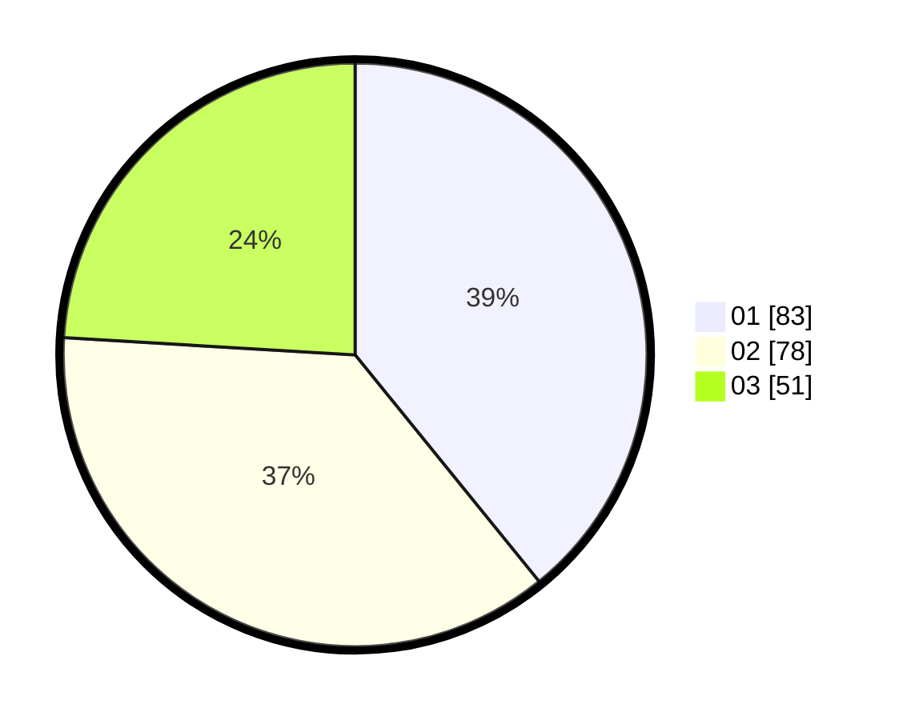

# Hasil

Hasil perolehan suara paslon dapat dilihat pada file paslon-01.txt, paslon-02.txt, dan paslon-03.txt.

Jika tidak ada, artinya data tersebut belum ada pada SIREKAP.

## Perolehan Suara

 * Paslon 01: **83**.
 * Paslon 02: **78**.
 * Paslon 03: **51**.

## Foto C Plano

https://sirekap-obj-formc.kpu.go.id/55e4/pemilu/ppwp/31/75/02/10/03/3175021003006-20240216-130055--e13f3f51-c3ac-4451-8cfb-c40677f9ffa9.jpg

https://sirekap-obj-formc.kpu.go.id/55e4/pemilu/ppwp/31/75/02/10/03/3175021003006-20240216-133442--9bd2a652-6a39-4937-b1e2-2f6d20b560e7.jpg

https://sirekap-obj-formc.kpu.go.id/55e4/pemilu/ppwp/31/75/02/10/03/3175021003006-20240216-130258--cbb8a6c3-8fbd-4374-ad23-cc51f244dd26.jpg

## DATA PEMILIH TETAP

Jumlah pemilih dalam DPT: **194**.
 * L: **85**.
 * P: **109**.

## DATA PENGGUNA HAK PILIH

Jumlah pengguna hak pilih dalam DPT: **194**.
 * L: **85**.
 * P: **109**.

Jumlah pengguna hak pilih dalam DPTb: **18**.
 * L: **15**.
 * P: **3**.

Jumlah pengguna hak pilih dalam DPK: **1**.
 * L: **0**.
 * P: **1**.

Jumlah pengguna hak pilih: **213**.
 * L: **100**.
 * P: **113**.

## JUMLAH SUARA SAH DAN TIDAK SAH

JUMLAH SELURUH SUARA SAH: **212**.

JUMLAH SUARA TIDAK SAH: **1**.

JUMLAH SELURUH SUARA SAH DAN SUARA TIDAK SAH: **213**.
