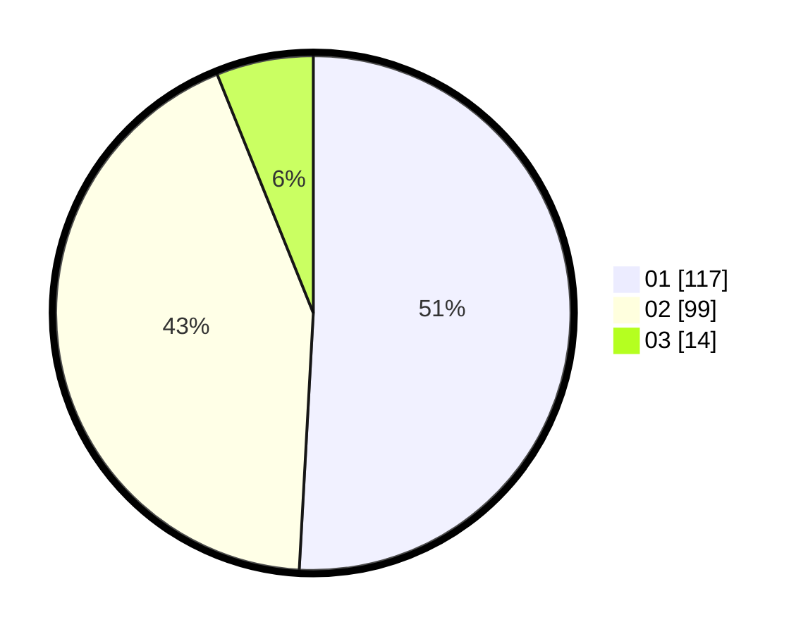

# Hasil

Hasil perolehan suara paslon dapat dilihat pada file paslon-01.txt, paslon-02.txt, dan paslon-03.txt.

Jika tidak ada, artinya data tersebut belum ada pada SIREKAP.

## Perolehan Suara

 * Paslon 01: **117**.
 * Paslon 02: **99**.
 * Paslon 03: **14**.

## Foto C Plano

https://sirekap-obj-formc.kpu.go.id/e134/pemilu/ppwp/31/75/02/10/03/3175021003007-20240214-231707--80b14e9a-0a86-42c1-84db-df7e08805743.jpg

https://sirekap-obj-formc.kpu.go.id/e134/pemilu/ppwp/31/75/02/10/03/3175021003007-20240214-231816--d00abc77-d98d-449b-9138-58ee1d213b9c.jpg

https://sirekap-obj-formc.kpu.go.id/e134/pemilu/ppwp/31/75/02/10/03/3175021003007-20240214-232029--30658cf8-5588-4a17-aaee-1636fd57a311.jpg

## DATA PEMILIH TETAP

Jumlah pemilih dalam DPT: **262**.
 * L: **135**.
 * P: **127**.

## DATA PENGGUNA HAK PILIH

Jumlah pengguna hak pilih dalam DPT: **218**.
 * L: **109**.
 * P: **109**.

Jumlah pengguna hak pilih dalam DPTb: **15**.
 * L: **5**.
 * P: **10**.

Jumlah pengguna hak pilih dalam DPK: **0**.
 * L: **0**.
 * P: **0**.

Jumlah pengguna hak pilih: **233**.
 * L: **114**.
 * P: **119**.

## JUMLAH SUARA SAH DAN TIDAK SAH

JUMLAH SELURUH SUARA SAH: **230**.

JUMLAH SUARA TIDAK SAH: **3**.

JUMLAH SELURUH SUARA SAH DAN SUARA TIDAK SAH: **233**.
