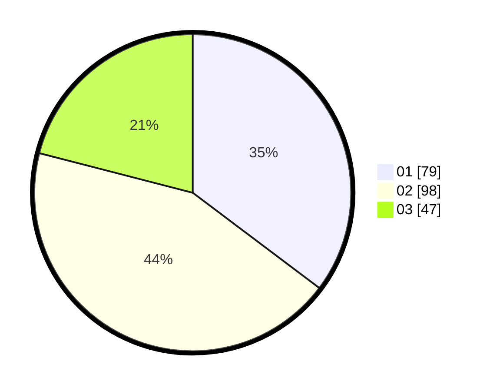

# Hasil

Hasil perolehan suara paslon dapat dilihat pada file paslon-01.txt, paslon-02.txt, dan paslon-03.txt.

Jika tidak ada, artinya data tersebut belum ada pada SIREKAP.

## Perolehan Suara

 * Paslon 01: **79**.
 * Paslon 02: **98**.
 * Paslon 03: **47**.

## Foto C Plano

https://sirekap-obj-formc.kpu.go.id/b911/pemilu/ppwp/31/75/02/10/03/3175021003013-20240214-223403--0274ffe3-4e5b-48fb-af93-c09383d840e5.jpg

https://sirekap-obj-formc.kpu.go.id/b911/pemilu/ppwp/31/75/02/10/03/3175021003013-20240214-223512--edcb8774-1435-4d83-918c-ff45dab1c388.jpg

https://sirekap-obj-formc.kpu.go.id/b911/pemilu/ppwp/31/75/02/10/03/3175021003013-20240214-223309--24d3c68c-2ffc-4fd8-a4c4-918e749abcae.jpg
