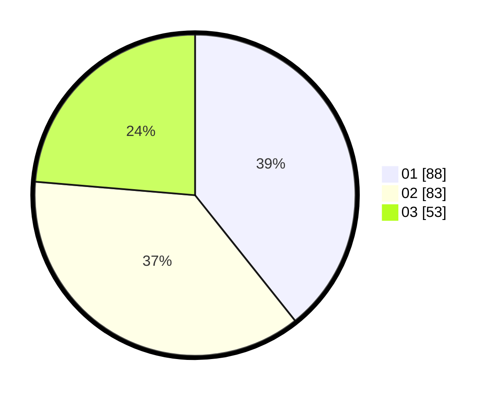

# Hasil

Hasil perolehan suara paslon dapat dilihat pada file paslon-01.txt, paslon-02.txt, dan paslon-03.txt.

Jika tidak ada, artinya data tersebut belum ada pada SIREKAP.

## Perolehan Suara

 * Paslon 01: **88**.
 * Paslon 02: **83**.
 * Paslon 03: **53**.

## Foto C Plano

https://sirekap-obj-formc.kpu.go.id/fcec/pemilu/ppwp/31/75/02/10/03/3175021003016-20240215-011642--2811132c-23f3-42ab-993a-fe69e108ae04.jpg

https://sirekap-obj-formc.kpu.go.id/fcec/pemilu/ppwp/31/75/02/10/03/3175021003016-20240215-011753--3ed7da95-1536-403c-8428-370677fd3ecb.jpg

https://sirekap-obj-formc.kpu.go.id/fcec/pemilu/ppwp/31/75/02/10/03/3175021003016-20240215-011854--485080c3-1314-420f-9457-572e6212be15.jpg
