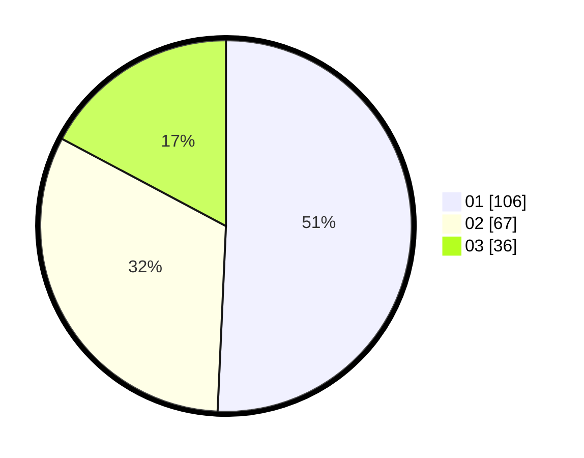

# Hasil

Hasil perolehan suara paslon dapat dilihat pada file paslon-01.txt, paslon-02.txt, dan paslon-03.txt.

Jika tidak ada, artinya data tersebut belum ada pada SIREKAP.

## Perolehan Suara

 * Paslon 01: **106**.
 * Paslon 02: **67**.
 * Paslon 03: **36**.

## Foto C Plano

https://sirekap-obj-formc.kpu.go.id/b631/pemilu/ppwp/31/75/02/10/03/3175021003021-20240214-223830--d1c519d9-bc4b-4563-9e8a-2690c8e54528.jpg

https://sirekap-obj-formc.kpu.go.id/b631/pemilu/ppwp/31/75/02/10/03/3175021003021-20240214-224001--3eeb42bb-9c75-4bdb-844d-e406209fa572.jpg

https://sirekap-obj-formc.kpu.go.id/b631/pemilu/ppwp/31/75/02/10/03/3175021003021-20240214-224104--c07cf1e9-dc38-4e4e-99e4-9fffd3a1cdc4.jpg

## DATA PEMILIH TETAP

Jumlah pemilih dalam DPT: **282**.
 * L: **149**.
 * P: **133**.

## DATA PENGGUNA HAK PILIH

Jumlah pengguna hak pilih dalam DPT: **212**.
 * L: **107**.
 * P: **105**.

Jumlah pengguna hak pilih dalam DPTb: **2**.
 * L: **0**.
 * P: **2**.

Jumlah pengguna hak pilih dalam DPK: **3**.
 * L: **2**.
 * P: **1**.

Jumlah pengguna hak pilih: **217**.
 * L: **109**.
 * P: **108**.

## JUMLAH SUARA SAH DAN TIDAK SAH

JUMLAH SELURUH SUARA SAH: **209**.

JUMLAH SUARA TIDAK SAH: **8**.

JUMLAH SELURUH SUARA SAH DAN SUARA TIDAK SAH: **217**.
