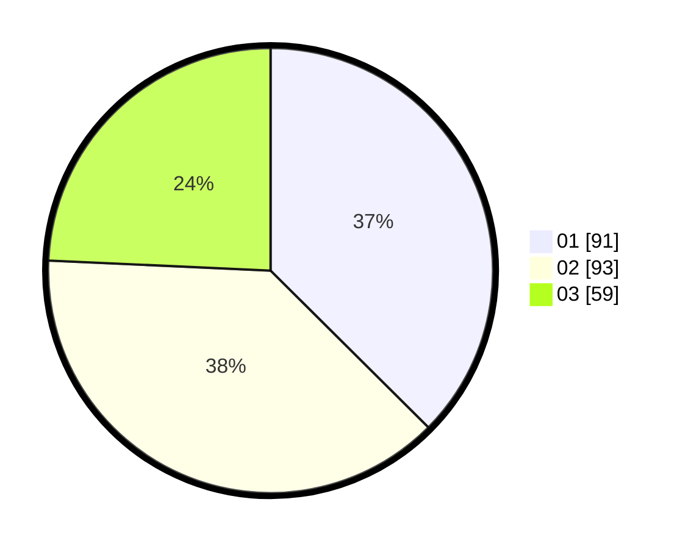

# Hasil

Hasil perolehan suara paslon dapat dilihat pada file paslon-01.txt, paslon-02.txt, dan paslon-03.txt.

Jika tidak ada, artinya data tersebut belum ada pada SIREKAP.

## Perolehan Suara

 * Paslon 01: **91**.
 * Paslon 02: **93**.
 * Paslon 03: **59**.

## Foto C Plano

https://sirekap-obj-formc.kpu.go.id/6de5/pemilu/ppwp/31/75/02/10/03/3175021003022-20240214-230122--666c0951-ec9e-486f-8be5-5429df9a6b25.jpg

https://sirekap-obj-formc.kpu.go.id/6de5/pemilu/ppwp/31/75/02/10/03/3175021003022-20240214-230256--805eb026-c03d-4034-a7ed-249db5ca1f6e.jpg

https://sirekap-obj-formc.kpu.go.id/6de5/pemilu/ppwp/31/75/02/10/03/3175021003022-20240214-230331--69d362ed-b776-4045-87c5-dc65179002ac.jpg
