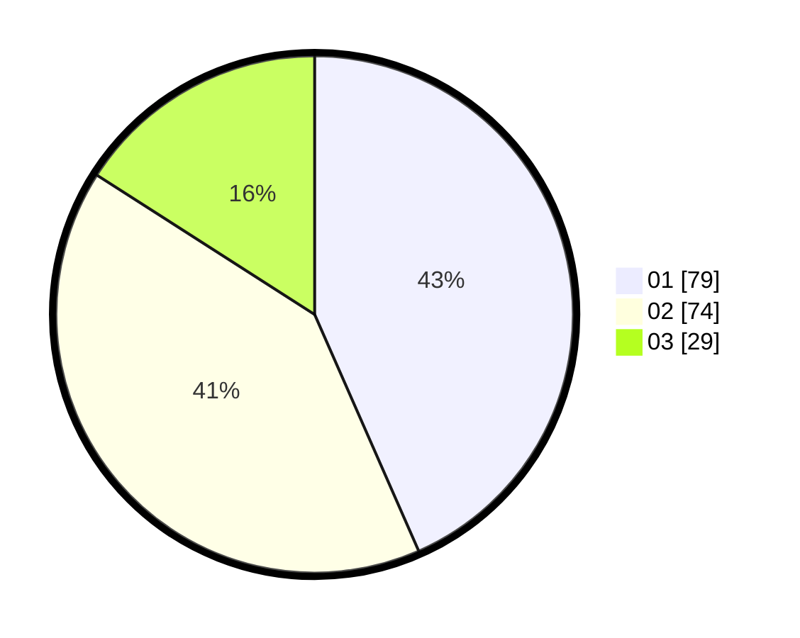

# Hasil

Hasil perolehan suara paslon dapat dilihat pada file paslon-01.txt, paslon-02.txt, dan paslon-03.txt.

Jika tidak ada, artinya data tersebut belum ada pada SIREKAP.

## Perolehan Suara

 * Paslon 01: **79**.
 * Paslon 02: **74**.
 * Paslon 03: **29**.

## Foto C Plano

https://sirekap-obj-formc.kpu.go.id/c4fb/pemilu/ppwp/31/75/02/10/03/3175021003026-20240218-111301--d78ad3f0-613b-4873-a795-10dd3250b317.jpg

https://sirekap-obj-formc.kpu.go.id/c4fb/pemilu/ppwp/31/75/02/10/03/3175021003026-20240218-111303--0e7322c8-8da0-4e3d-996c-b6deba1a6d52.jpg

https://sirekap-obj-formc.kpu.go.id/c4fb/pemilu/ppwp/31/75/02/10/03/3175021003026-20240218-111302--26ea3e60-7803-4a6e-a609-201b50ddfd22.jpg

## DATA PEMILIH TETAP

Jumlah pemilih dalam DPT: **262**.
 * L: **127**.
 * P: **135**.

## DATA PENGGUNA HAK PILIH

Jumlah pengguna hak pilih dalam DPT: **186**.
 * L: **85**.
 * P: **101**.

Jumlah pengguna hak pilih dalam DPTb: **2**.
 * L: **1**.
 * P: **1**.

Jumlah pengguna hak pilih dalam DPK: **1**.
 * L: **1**.
 * P: **0**.

Jumlah pengguna hak pilih: **189**.
 * L: **87**.
 * P: **102**.

## JUMLAH SUARA SAH DAN TIDAK SAH

JUMLAH SELURUH SUARA SAH: **182**.

JUMLAH SUARA TIDAK SAH: **7**.

JUMLAH SELURUH SUARA SAH DAN SUARA TIDAK SAH: **189**.
