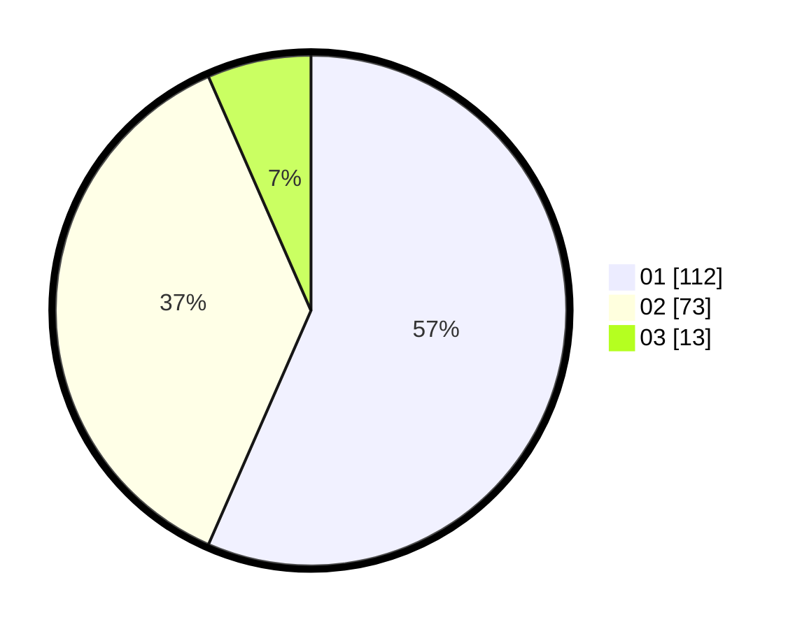

# Hasil

Hasil perolehan suara paslon dapat dilihat pada file paslon-01.txt, paslon-02.txt, dan paslon-03.txt.

Jika tidak ada, artinya data tersebut belum ada pada SIREKAP.

## Perolehan Suara

 * Paslon 01: **112**.
 * Paslon 02: **73**.
 * Paslon 03: **13**.

## Foto C Plano

https://sirekap-obj-formc.kpu.go.id/eebd/pemilu/ppwp/31/75/02/10/03/3175021003028-20240215-001448--040781b6-53b4-4669-a231-d8959b9e5076.jpg

https://sirekap-obj-formc.kpu.go.id/eebd/pemilu/ppwp/31/75/02/10/03/3175021003028-20240215-001706--f3415d5e-accd-4277-80f8-1c391f7d26a1.jpg

https://sirekap-obj-formc.kpu.go.id/eebd/pemilu/ppwp/31/75/02/10/03/3175021003028-20240215-002408--6083ad4a-4739-41be-81b9-35cea3c4df33.jpg
