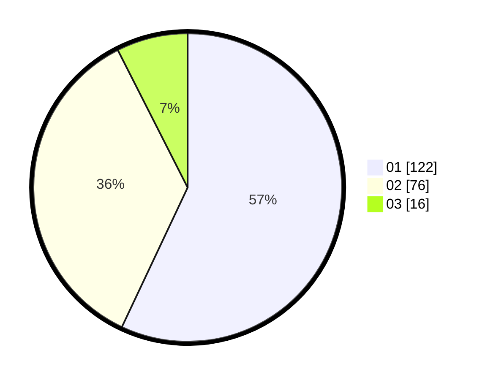

# Hasil

Hasil perolehan suara paslon dapat dilihat pada file paslon-01.txt, paslon-02.txt, dan paslon-03.txt.

Jika tidak ada, artinya data tersebut belum ada pada SIREKAP.

## Perolehan Suara

 * Paslon 01: **122**.
 * Paslon 02: **76**.
 * Paslon 03: **16**.

## Foto C Plano

https://sirekap-obj-formc.kpu.go.id/5bc6/pemilu/ppwp/31/75/02/10/03/3175021003029-20240215-004240--06551cd4-6d63-4f2c-8fd8-a3c33413e822.jpg

https://sirekap-obj-formc.kpu.go.id/5bc6/pemilu/ppwp/31/75/02/10/03/3175021003029-20240215-004249--a2fa7c27-439e-4864-9e49-c8864d112d73.jpg

https://sirekap-obj-formc.kpu.go.id/5bc6/pemilu/ppwp/31/75/02/10/03/3175021003029-20240215-004255--baa96ef6-e210-447b-9ebf-f44621fa556f.jpg
