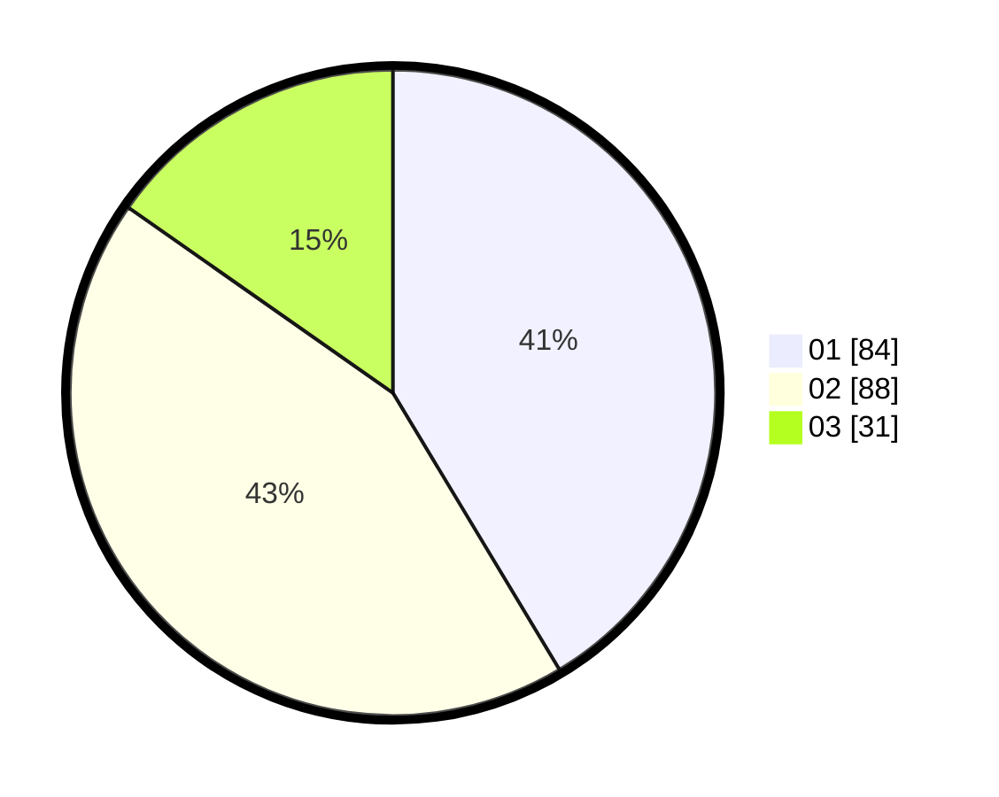

# Hasil

Hasil perolehan suara paslon dapat dilihat pada file paslon-01.txt, paslon-02.txt, dan paslon-03.txt.

Jika tidak ada, artinya data tersebut belum ada pada SIREKAP.

## Perolehan Suara

 * Paslon 01: **84**.
 * Paslon 02: **88**.
 * Paslon 03: **31**.

## Foto C Plano

https://sirekap-obj-formc.kpu.go.id/007d/pemilu/ppwp/31/75/02/10/03/3175021003031-20240215-024954--4dc360cc-b8b7-4e8a-9acc-ab2330e2422f.jpg

https://sirekap-obj-formc.kpu.go.id/007d/pemilu/ppwp/31/75/02/10/03/3175021003031-20240215-004949--49d3e3e2-dc27-4a5f-8bc8-0bef4cc0270f.jpg

https://sirekap-obj-formc.kpu.go.id/007d/pemilu/ppwp/31/75/02/10/03/3175021003031-20240215-005016--4b508d55-cd63-492e-a27b-73956d1202e5.jpg
