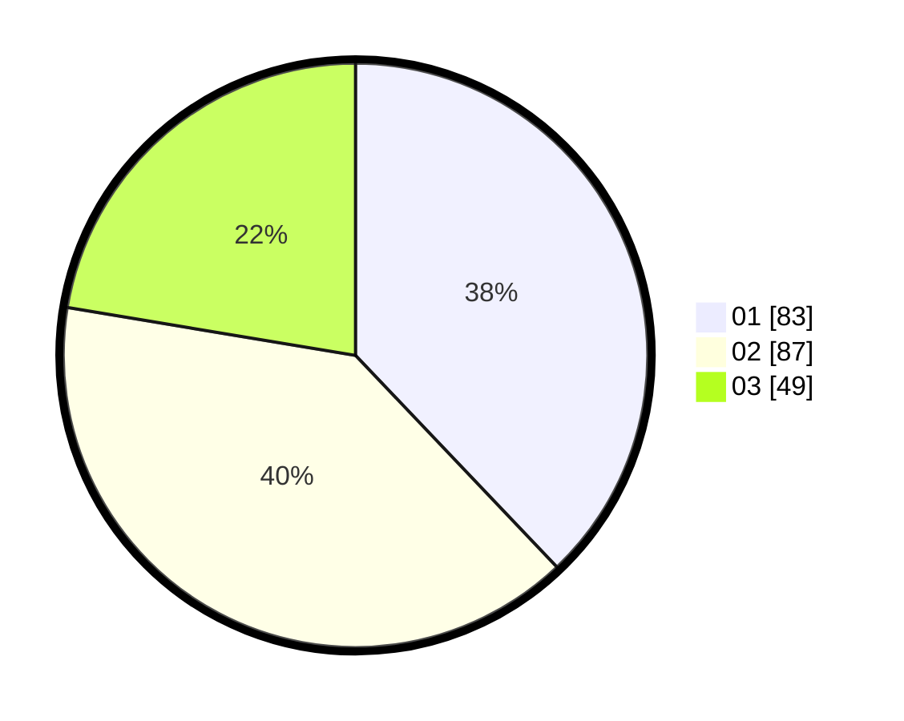

# Hasil

Hasil perolehan suara paslon dapat dilihat pada file paslon-01.txt, paslon-02.txt, dan paslon-03.txt.

Jika tidak ada, artinya data tersebut belum ada pada SIREKAP.

## Perolehan Suara

 * Paslon 01: **83**.
 * Paslon 02: **87**.
 * Paslon 03: **49**.

## Foto C Plano

https://sirekap-obj-formc.kpu.go.id/3617/pemilu/ppwp/31/75/02/10/03/3175021003034-20240214-233710--fedfbf10-ae46-4e0c-95c2-3b55ffad9395.jpg

https://sirekap-obj-formc.kpu.go.id/3617/pemilu/ppwp/31/75/02/10/03/3175021003034-20240214-233827--3a796241-9e26-4d23-8b90-ff2110214b75.jpg
