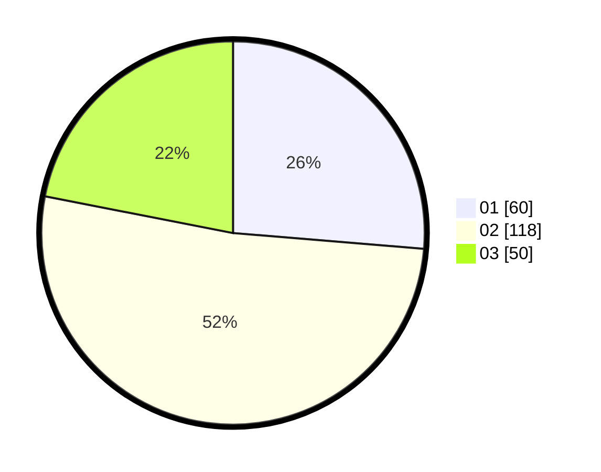

# Hasil

Hasil perolehan suara paslon dapat dilihat pada file paslon-01.txt, paslon-02.txt, dan paslon-03.txt.

Jika tidak ada, artinya data tersebut belum ada pada SIREKAP.

## Perolehan Suara

 * Paslon 01: **60**.
 * Paslon 02: **118**.
 * Paslon 03: **50**.

## Foto C Plano

https://sirekap-obj-formc.kpu.go.id/d2c4/pemilu/ppwp/31/75/02/10/03/3175021003037-20240214-232610--c12c8088-2280-400b-b347-1bea0a862567.jpg

https://sirekap-obj-formc.kpu.go.id/d2c4/pemilu/ppwp/31/75/02/10/03/3175021003037-20240214-232717--71221b4a-54d8-4d90-8455-e7a7337a8bc7.jpg

https://sirekap-obj-formc.kpu.go.id/d2c4/pemilu/ppwp/31/75/02/10/03/3175021003037-20240214-232908--2969e967-ffaa-4e0f-878c-580e739be41e.jpg
