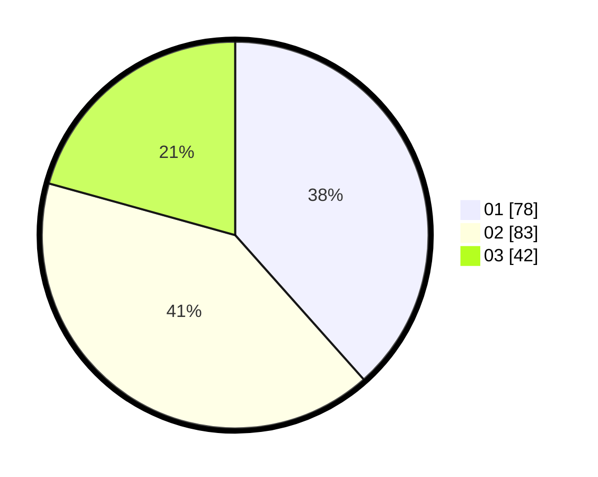

# Hasil

Hasil perolehan suara paslon dapat dilihat pada file paslon-01.txt, paslon-02.txt, dan paslon-03.txt.

Jika tidak ada, artinya data tersebut belum ada pada SIREKAP.

## Perolehan Suara

 * Paslon 01: **78**.
 * Paslon 02: **83**.
 * Paslon 03: **42**.

## Foto C Plano

https://sirekap-obj-formc.kpu.go.id/bd26/pemilu/ppwp/31/75/02/10/03/3175021003038-20240214-202312--cdbf60d1-e5f4-4988-ba14-3743b6bc26f6.jpg

https://sirekap-obj-formc.kpu.go.id/bd26/pemilu/ppwp/31/75/02/10/03/3175021003038-20240214-201517--e273b72c-da99-4375-9c4b-31810ad617b1.jpg

https://sirekap-obj-formc.kpu.go.id/bd26/pemilu/ppwp/31/75/02/10/03/3175021003038-20240214-201938--4f38ac21-453b-4be5-84e5-9b98edd9a66d.jpg

## DATA PEMILIH TETAP

Jumlah pemilih dalam DPT: **265**.
 * L: **118**.
 * P: **147**.

## DATA PENGGUNA HAK PILIH

Jumlah pengguna hak pilih dalam DPT: **202**.
 * L: **83**.
 * P: **119**.

Jumlah pengguna hak pilih dalam DPTb: **2**.
 * L: **0**.
 * P: **2**.

Jumlah pengguna hak pilih dalam DPK: **2**.
 * L: **0**.
 * P: **2**.

Jumlah pengguna hak pilih: **206**.
 * L: **83**.
 * P: **123**.

## JUMLAH SUARA SAH DAN TIDAK SAH

JUMLAH SELURUH SUARA SAH: **203**.

JUMLAH SUARA TIDAK SAH: **3**.

JUMLAH SELURUH SUARA SAH DAN SUARA TIDAK SAH: **206**.
