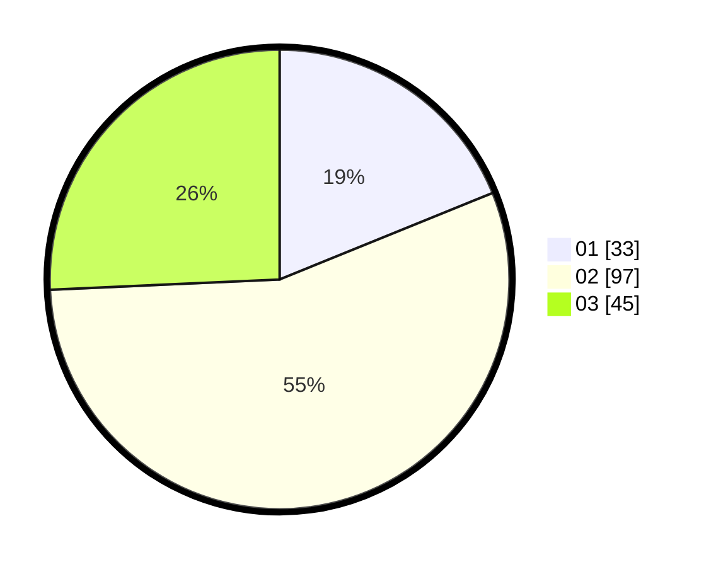

# Hasil

Hasil perolehan suara paslon dapat dilihat pada file paslon-01.txt, paslon-02.txt, dan paslon-03.txt.

Jika tidak ada, artinya data tersebut belum ada pada SIREKAP.

## Perolehan Suara

 * Paslon 01: **33**.
 * Paslon 02: **97**.
 * Paslon 03: **45**.

## Foto C Plano

https://sirekap-obj-formc.kpu.go.id/d62c/pemilu/ppwp/31/75/02/10/03/3175021003039-20240215-033055--751143f5-eb24-4e52-81e5-d445d5a706d9.jpg

https://sirekap-obj-formc.kpu.go.id/d62c/pemilu/ppwp/31/75/02/10/03/3175021003039-20240214-190101--942db60c-82d5-46da-914c-8a1fb71cf5d6.jpg
