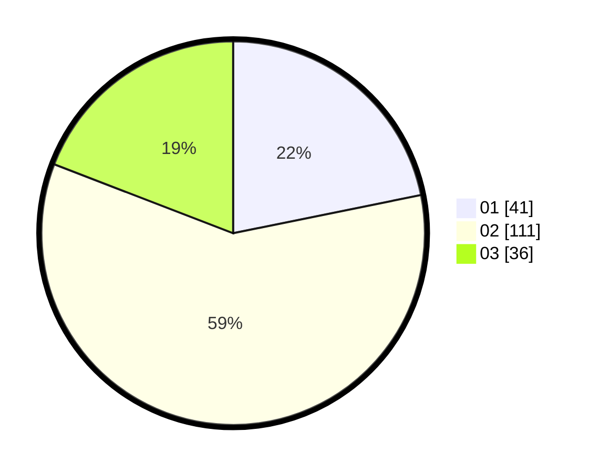

# Hasil

Hasil perolehan suara paslon dapat dilihat pada file paslon-01.txt, paslon-02.txt, dan paslon-03.txt.

Jika tidak ada, artinya data tersebut belum ada pada SIREKAP.

## Perolehan Suara

 * Paslon 01: **41**.
 * Paslon 02: **111**.
 * Paslon 03: **36**.

## Foto C Plano

https://sirekap-obj-formc.kpu.go.id/c172/pemilu/ppwp/31/75/02/10/03/3175021003043-20240214-191603--c29df34c-f301-4731-9e9e-18ff0812ae03.jpg

https://sirekap-obj-formc.kpu.go.id/c172/pemilu/ppwp/31/75/02/10/03/3175021003043-20240214-191954--c91ec4a3-4865-48b9-8586-d9197d79c03f.jpg

https://sirekap-obj-formc.kpu.go.id/c172/pemilu/ppwp/31/75/02/10/03/3175021003043-20240214-192400--ed75fb95-58d5-49f9-8348-7143ba949894.jpg

## DATA PEMILIH TETAP

Jumlah pemilih dalam DPT: **252**.
 * L: **100**.
 * P: **152**.

## DATA PENGGUNA HAK PILIH

Jumlah pengguna hak pilih dalam DPT: **191**.
 * L: **67**.
 * P: **124**.

Jumlah pengguna hak pilih dalam DPTb: **1**.
 * L: **1**.
 * P: **0**.

Jumlah pengguna hak pilih dalam DPK: **3**.
 * L: **2**.
 * P: **1**.

Jumlah pengguna hak pilih: **195**.
 * L: **70**.
 * P: **125**.

## JUMLAH SUARA SAH DAN TIDAK SAH

JUMLAH SELURUH SUARA SAH: **188**.

JUMLAH SUARA TIDAK SAH: **7**.

JUMLAH SELURUH SUARA SAH DAN SUARA TIDAK SAH: **195**.
