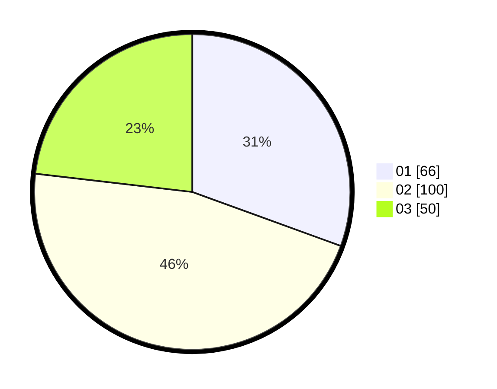

# Hasil

Hasil perolehan suara paslon dapat dilihat pada file paslon-01.txt, paslon-02.txt, dan paslon-03.txt.

Jika tidak ada, artinya data tersebut belum ada pada SIREKAP.

## Perolehan Suara

 * Paslon 01: **66**.
 * Paslon 02: **100**.
 * Paslon 03: **50**.

## Foto C Plano

https://sirekap-obj-formc.kpu.go.id/0a6b/pemilu/ppwp/31/75/02/10/03/3175021003044-20240216-130918--f6f5a7f1-ba22-475e-88c1-60800e132bf7.jpg

https://sirekap-obj-formc.kpu.go.id/0a6b/pemilu/ppwp/31/75/02/10/03/3175021003044-20240216-130920--73a89244-b3d0-421c-a7d3-1917c7718c24.jpg

https://sirekap-obj-formc.kpu.go.id/0a6b/pemilu/ppwp/31/75/02/10/03/3175021003044-20240216-130918--ff7c1e1c-082a-4e5c-811e-c0aa359720cd.jpg

## DATA PEMILIH TETAP

Jumlah pemilih dalam DPT: **266**.
 * L: **114**.
 * P: **152**.

## DATA PENGGUNA HAK PILIH

Jumlah pengguna hak pilih dalam DPT: **214**.
 * L: **86**.
 * P: **128**.

Jumlah pengguna hak pilih dalam DPTb: **1**.
 * L: **0**.
 * P: **1**.

Jumlah pengguna hak pilih dalam DPK: **4**.
 * L: **2**.
 * P: **2**.

Jumlah pengguna hak pilih: **219**.
 * L: **88**.
 * P: **131**.

## JUMLAH SUARA SAH DAN TIDAK SAH

JUMLAH SELURUH SUARA SAH: **216**.

JUMLAH SUARA TIDAK SAH: **3**.

JUMLAH SELURUH SUARA SAH DAN SUARA TIDAK SAH: **219**.
