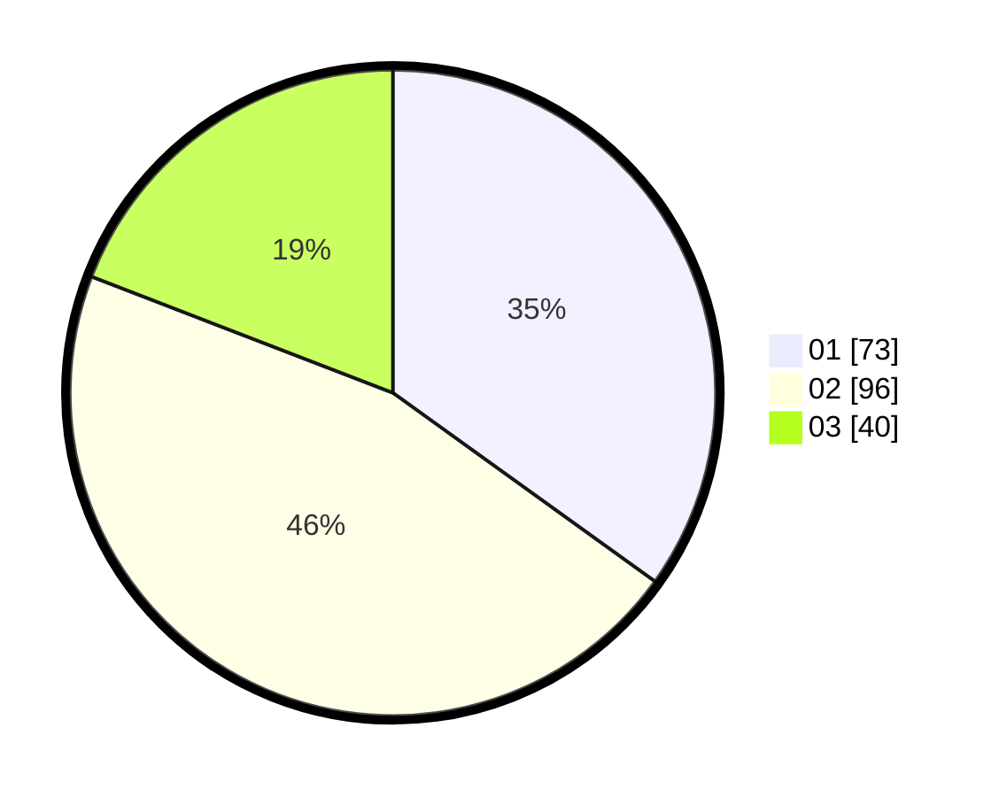

# Hasil

Hasil perolehan suara paslon dapat dilihat pada file paslon-01.txt, paslon-02.txt, dan paslon-03.txt.

Jika tidak ada, artinya data tersebut belum ada pada SIREKAP.

## Perolehan Suara

 * Paslon 01: **73**.
 * Paslon 02: **96**.
 * Paslon 03: **40**.

## Foto C Plano

https://sirekap-obj-formc.kpu.go.id/1423/pemilu/ppwp/31/75/02/10/03/3175021003046-20240216-115804--89ac28db-9b97-4ab5-a041-dfa657d46966.jpg

https://sirekap-obj-formc.kpu.go.id/1423/pemilu/ppwp/31/75/02/10/03/3175021003046-20240216-115811--85724da6-ed99-4f49-83b7-a8f8d5261777.jpg

https://sirekap-obj-formc.kpu.go.id/1423/pemilu/ppwp/31/75/02/10/03/3175021003046-20240216-115807--14ac8326-d53c-403e-b177-77dd91a62eab.jpg

## DATA PEMILIH TETAP

Jumlah pemilih dalam DPT: **266**.
 * L: **121**.
 * P: **148**.

## DATA PENGGUNA HAK PILIH

Jumlah pengguna hak pilih dalam DPT: **212**.
 * L: **93**.
 * P: **119**.

Jumlah pengguna hak pilih dalam DPTb: **0**.
 * L: **0**.
 * P: **0**.

Jumlah pengguna hak pilih dalam DPK: **1**.
 * L: **0**.
 * P: **1**.

Jumlah pengguna hak pilih: **213**.
 * L: **93**.
 * P: **120**.

## JUMLAH SUARA SAH DAN TIDAK SAH

JUMLAH SELURUH SUARA SAH: **209**.

JUMLAH SUARA TIDAK SAH: **4**.

JUMLAH SELURUH SUARA SAH DAN SUARA TIDAK SAH: **213**.
