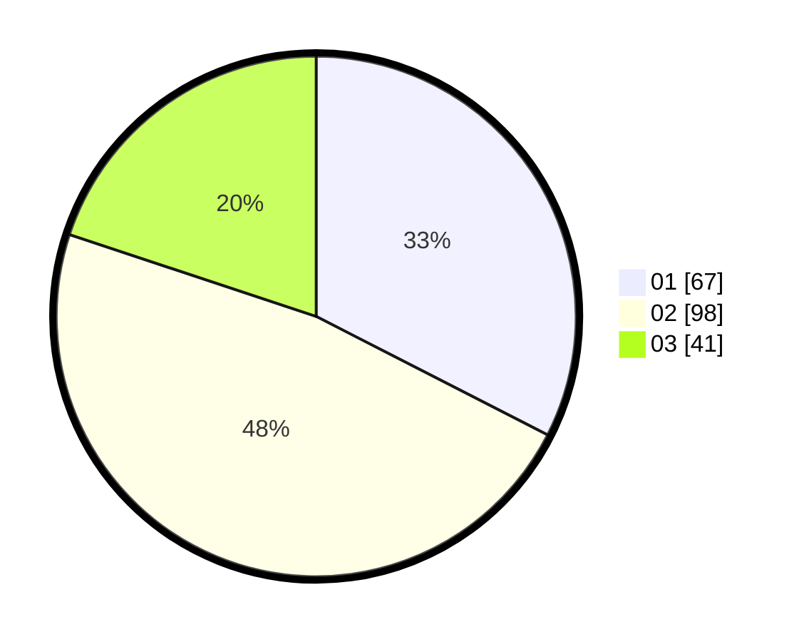

# Hasil

Hasil perolehan suara paslon dapat dilihat pada file paslon-01.txt, paslon-02.txt, dan paslon-03.txt.

Jika tidak ada, artinya data tersebut belum ada pada SIREKAP.

## Perolehan Suara

 * Paslon 01: **67**.
 * Paslon 02: **98**.
 * Paslon 03: **41**.

## Foto C Plano

https://sirekap-obj-formc.kpu.go.id/0794/pemilu/ppwp/31/75/02/10/03/3175021003048-20240216-114802--f9e58143-d547-4fd8-b490-0f6b0810807c.jpg

https://sirekap-obj-formc.kpu.go.id/0794/pemilu/ppwp/31/75/02/10/03/3175021003048-20240216-114803--d74a6e5d-4fce-4ee4-a927-79fab4c67e9b.jpg

https://sirekap-obj-formc.kpu.go.id/0794/pemilu/ppwp/31/75/02/10/03/3175021003048-20240215-002040--65257558-db23-4339-bca1-0716a4f823d5.jpg

## DATA PEMILIH TETAP

Jumlah pemilih dalam DPT: **259**.
 * L: **111**.
 * P: **148**.

## DATA PENGGUNA HAK PILIH

Jumlah pengguna hak pilih dalam DPT: **205**.
 * L: **85**.
 * P: **120**.

Jumlah pengguna hak pilih dalam DPTb: **0**.
 * L: **0**.
 * P: **0**.

Jumlah pengguna hak pilih dalam DPK: **5**.
 * L: **3**.
 * P: **2**.

Jumlah pengguna hak pilih: **210**.
 * L: **88**.
 * P: **122**.

## JUMLAH SUARA SAH DAN TIDAK SAH

JUMLAH SELURUH SUARA SAH: **206**.

JUMLAH SUARA TIDAK SAH: **4**.

JUMLAH SELURUH SUARA SAH DAN SUARA TIDAK SAH: **210**.
