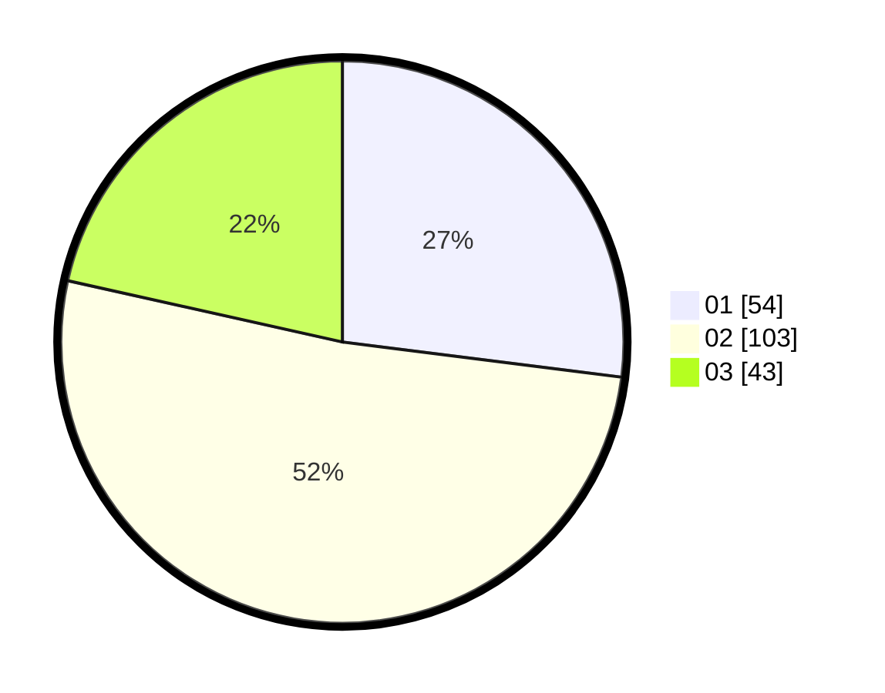

# Hasil

Hasil perolehan suara paslon dapat dilihat pada file paslon-01.txt, paslon-02.txt, dan paslon-03.txt.

Jika tidak ada, artinya data tersebut belum ada pada SIREKAP.

## Perolehan Suara

 * Paslon 01: **54**.
 * Paslon 02: **103**.
 * Paslon 03: **43**.

## Foto C Plano

https://sirekap-obj-formc.kpu.go.id/4dd2/pemilu/ppwp/31/75/02/10/03/3175021003050-20240216-164402--3545e08e-5c17-4fbe-bd3e-f123287ba484.jpg

https://sirekap-obj-formc.kpu.go.id/4dd2/pemilu/ppwp/31/75/02/10/03/3175021003050-20240216-164403--af617d93-d099-4722-bd4a-c6a3f4920a13.jpg

https://sirekap-obj-formc.kpu.go.id/4dd2/pemilu/ppwp/31/75/02/10/03/3175021003050-20240216-164403--571beb07-0369-4eee-ad06-be2cfc0a6286.jpg

## DATA PEMILIH TETAP

Jumlah pemilih dalam DPT: **262**.
 * L: **112**.
 * P: **150**.

## DATA PENGGUNA HAK PILIH

Jumlah pengguna hak pilih dalam DPT: **197**.
 * L: **82**.
 * P: **115**.

Jumlah pengguna hak pilih dalam DPTb: **1**.
 * L: **0**.
 * P: **1**.

Jumlah pengguna hak pilih dalam DPK: **2**.
 * L: **2**.
 * P: **0**.

Jumlah pengguna hak pilih: **200**.
 * L: **84**.
 * P: **116**.

## JUMLAH SUARA SAH DAN TIDAK SAH

JUMLAH SELURUH SUARA SAH: **200**.

JUMLAH SUARA TIDAK SAH: **1**.

JUMLAH SELURUH SUARA SAH DAN SUARA TIDAK SAH: **201**.
