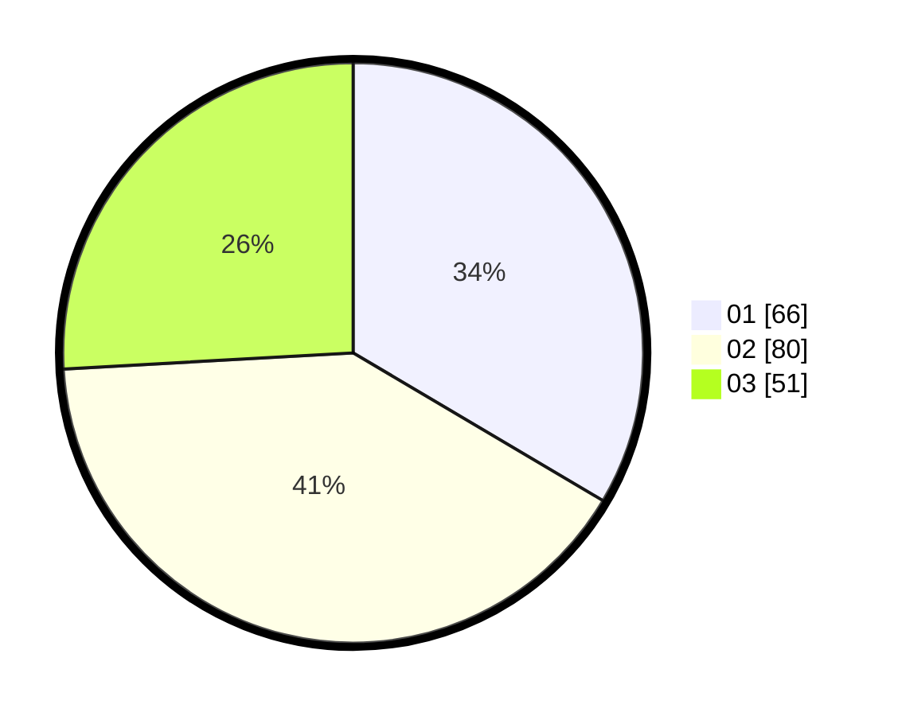

# Hasil

Hasil perolehan suara paslon dapat dilihat pada file paslon-01.txt, paslon-02.txt, dan paslon-03.txt.

Jika tidak ada, artinya data tersebut belum ada pada SIREKAP.

## Perolehan Suara

 * Paslon 01: **66**.
 * Paslon 02: **80**.
 * Paslon 03: **51**.

## Foto C Plano

https://sirekap-obj-formc.kpu.go.id/4b82/pemilu/ppwp/31/75/02/10/03/3175021003052-20240215-021607--e9ec3bdf-1861-4d9e-877b-b3127f316ce4.jpg

https://sirekap-obj-formc.kpu.go.id/4b82/pemilu/ppwp/31/75/02/10/03/3175021003052-20240215-021732--54d5cc00-75d6-4bde-b601-dec8814a4c1e.jpg

https://sirekap-obj-formc.kpu.go.id/4b82/pemilu/ppwp/31/75/02/10/03/3175021003052-20240215-021902--25bf8ebc-eb01-4382-8a0e-0c0e1f22a076.jpg

## DATA PEMILIH TETAP

Jumlah pemilih dalam DPT: **267**.
 * L: **122**.
 * P: **145**.

## DATA PENGGUNA HAK PILIH

Jumlah pengguna hak pilih dalam DPT: **188**.
 * L: **80**.
 * P: **108**.

Jumlah pengguna hak pilih dalam DPTb: **10**.
 * L: **3**.
 * P: **7**.

Jumlah pengguna hak pilih dalam DPK: **6**.
 * L: **0**.
 * P: **6**.

Jumlah pengguna hak pilih: **204**.
 * L: **83**.
 * P: **121**.

## JUMLAH SUARA SAH DAN TIDAK SAH

JUMLAH SELURUH SUARA SAH: **197**.

JUMLAH SUARA TIDAK SAH: **7**.

JUMLAH SELURUH SUARA SAH DAN SUARA TIDAK SAH: **204**.
