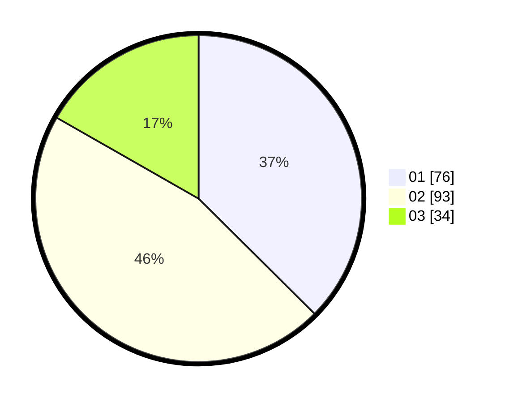

# Hasil

Hasil perolehan suara paslon dapat dilihat pada file paslon-01.txt, paslon-02.txt, dan paslon-03.txt.

Jika tidak ada, artinya data tersebut belum ada pada SIREKAP.

## Perolehan Suara

 * Paslon 01: **76**.
 * Paslon 02: **93**.
 * Paslon 03: **34**.

## Foto C Plano

https://sirekap-obj-formc.kpu.go.id/ec2a/pemilu/ppwp/31/75/02/10/03/3175021003057-20240214-200230--f332773f-7edf-4403-bf9b-d961732a03eb.jpg

https://sirekap-obj-formc.kpu.go.id/ec2a/pemilu/ppwp/31/75/02/10/03/3175021003057-20240214-200246--105cf041-a694-4a50-9969-f78a03594a21.jpg

https://sirekap-obj-formc.kpu.go.id/ec2a/pemilu/ppwp/31/75/02/10/03/3175021003057-20240214-200353--fb83b0b0-4096-4fa4-b557-94060977c792.jpg

## DATA PEMILIH TETAP

Jumlah pemilih dalam DPT: **265**.
 * L: **123**.
 * P: **142**.

## DATA PENGGUNA HAK PILIH

Jumlah pengguna hak pilih dalam DPT: **209**.
 * L: **93**.
 * P: **116**.

Jumlah pengguna hak pilih dalam DPTb: **1**.
 * L: **1**.
 * P: **0**.

Jumlah pengguna hak pilih dalam DPK: **1**.
 * L: **1**.
 * P: **0**.

Jumlah pengguna hak pilih: **211**.
 * L: **95**.
 * P: **116**.

## JUMLAH SUARA SAH DAN TIDAK SAH

JUMLAH SELURUH SUARA SAH: **203**.

JUMLAH SUARA TIDAK SAH: **8**.

JUMLAH SELURUH SUARA SAH DAN SUARA TIDAK SAH: **211**.
